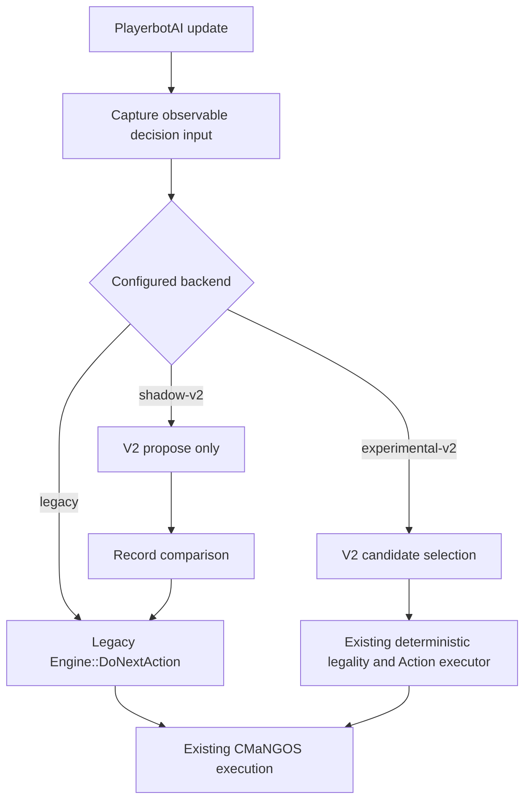

# Playerbots experimental engine rewrite plan

**Status:** proposed research and implementation plan  
**Target phase:** offline O13, after the O12 zero-bot persistence and recovery gate  
**Default product behavior:** legacy Playerbots engine  
**Long-term stretch target:** approximately 500 credibly simulated bots on a Snapdragon 8 Gen 2 reference device  
**Research input:** `docs/CMaNGOS_Playerbots_Architecture_Study_2026-08-01_Source.zip`

## 1. Decision

Add a second, experimental decision engine behind `PlayerbotAI` and retain the current engine as the default and rollback path.

The experimental engine will not replace the existing Playerbots Actions, class/spec knowledge, command handling, spell legality, movement execution, or CMaNGOS integration. It will initially replace only **how legal actions are selected and coordinated**.

Support three explicit runtime modes:

| Mode | Authority | Purpose |
|---|---|---|
| `legacy` | Existing `Engine::DoNextAction` | Shipping baseline and immediate rollback path |
| `shadow-v2` | Legacy engine executes; V2 only proposes | Compare decisions safely without changing gameplay |
| `experimental-v2` | V2 selects; existing Actions execute | Controlled A/B testing after shadow gates pass |

The implementation must remain build-time removable, runtime disabled by default, and free of persistent-schema changes during the experiment.

## 2. Why this boundary

The pinned implementation already provides a useful seam:

- `PlayerbotAI` owns one `Engine` per `BotState` and routes decisions through `PlayerbotAI::DoNextAction`.
- `Engine::ExecuteAction` is public and already performs the existing action execution path.
- Actions contain mature class, spell, target, inventory, travel, encounter, and command knowledge that should not be rewritten during the orchestration experiment.
- `AiObjectContext` and existing Values can serve as a compatibility source while typed observations are introduced gradually.

The first rewrite should therefore be a **decision backend**, not a ground-up replacement bot.



## 3. Goals

1. Make engine selection reversible and observable.
2. Improve party coordination, tactical intent, positioning, reaction quality, and believability.
3. Reduce repeated per-bot work through scheduling and shared scoped observations.
4. Preserve existing commands and class-specific Actions throughout migration.
5. Produce deterministic decision traces and repeatable A/B scenarios.
6. Establish a clean typed input boundary for an optional future learned scorer without requiring one.
7. Protect human-visible, human-party, combat, and instance behavior before reducing background work.

## 4. Non-goals for the first experiment

- Rewriting every existing Action or class rotation.
- Moving authoritative AI outside the active CMaNGOS simulation.
- Adding an LLM to combat, movement, planning, or command handling.
- Adding an NPU dependency before a small CPU policy and end-to-end benchmark exist.
- Changing character, inventory, quest, account, or bot database formats.
- Shipping V2 as the default before behaviour, persistence, recovery, and physical-device gates pass.
- Hiding load by counting inert characters as fully simulated bots.

## 5. Proposed components

Place new code in a self-contained `playerbot/engine2/` subtree where practical.

### 5.1 Backend router

`DecisionBackendRouter` resolves the effective backend for each bot and state.

Inputs:

- global configured mode;
- deterministic experiment cohort;
- optional development-only bot GUID allowlist;
- current `BotState`;
- experimental circuit-breaker state.

The router must not change engines in the middle of a cast, teleport, taxi flight, pending command, or active action chain. Normal live changes become effective at a safe decision boundary. A forced development switch must cancel V2 reservations and emit an explicit diagnostic event.

### 5.2 Compatibility interfaces

Introduce narrow interfaces rather than making the new implementation depend on all of `PlayerbotAI`:

```text
BotObservationProvider -> BotDecisionInput
IBotDecisionBackend::Propose(input) -> BotDecision
BotActionExecutor::Execute(decision) -> ActionResult
BotDecisionRecorder::Record(input, decision, result)
```

`BotActionExecutor` maps a stable action identifier to the existing named Action and calls the existing execution and legality path. It must revalidate the action immediately before execution. V2 never bypasses cooldown, resource, target, range, line-of-sight, movement, command, or ownership checks.

Initially, the existing `ReactionEngine`, packet processing, chat commands, `DoSpecificAction`, dead-state handling, and teleport lifecycle remain authoritative. V2 is invoked only when the current path would otherwise reach the state engine's normal `DoNextAction`. Migrate those other boundaries only through separate experiments.

### 5.3 Typed decision input

The initial `BotDecisionInput` is an immutable, short-lived snapshot containing only facts needed by the first test slice:

- bot/state/role and observation generation;
- observable health, power, auras, cooldown summaries, and movement state;
- current observable targets and active casts;
- group member role and health summaries;
- current human command/intent;
- active party reservations;
- decision deadline and fidelity class;
- legal candidate identifiers or the facts required to generate them;
- timestamps/age for observed facts.

No raw pointer may survive the decision call. Snapshot results are discarded when their bot, target, encounter, or observation generation is stale.

The observation layer must eventually mask server-private knowledge so competence does not depend on omniscience.

### 5.4 Decision result and reason trace

Every V2 proposal returns:

- selected action ID and target ID;
- current mode and tactical intent;
- decomposed score terms;
- reservations created, consumed, or released;
- rejected candidates with compact reason codes;
- input generation and decision deadline;
- elapsed decision cost;
- fallback or no-action reason.

Use fixed-size/ring-buffer diagnostics in the hot path. Human-readable formatting happens outside timing-critical code.

### 5.5 Experimental hierarchical selector

Use a bounded hierarchy:

1. **Mode:** dead/recover, travel, maintenance, regroup, prepare pull, combat, flee, or encounter mechanic.
2. **Intent:** assist, control, protect, recover, reposition, retreat, or pursue objective.
3. **Tactical candidate:** a small set of existing Actions relevant to the current intent.
4. **Legality:** existing deterministic Action checks.
5. **Execution:** existing Playerbots/CMaNGOS path.

A candidate score should be decomposable, for example:

```text
goal + urgency + role fit + coordination value
- danger - resource cost - movement cost - repetition penalty
```

Hard illegality removes a candidate; it is not represented as a large negative score. Hysteresis prevents oscillation between near-equal choices.

### 5.6 Party blackboard

Add a world-thread-owned, bounded blackboard keyed by party and encounter generation. Avoid global locks in the first implementation.

Initial reservations:

1. enemy interrupt;
2. incoming heal;
3. dispel;
4. crowd-control target;
5. tank/kill target;
6. position slot.

Each reservation contains owner, target, expected effect, creation time, expiry, backup order, and cancellation reason. Reservations automatically expire and are invalidated by death, target generation change, range/LOS loss, cooldown loss, command override, or encounter reset.

Start with interrupts and heals. Add the remaining types only after those demonstrate measurable value.

### 5.7 Deadline scheduler

V2 should run on the authoritative world thread initially. Do not introduce asynchronous decisions until snapshot immutability, stale-result rejection, and deterministic replay are proven.

The scheduler uses:

- event wakeups for commands, damage, casts, aura changes, deaths, target changes, path failure, and visibility transitions;
- deterministic deadlines staggered by stable IDs;
- explicit priority for human commands, human-party bots, visible combat, and encounter mechanics;
- fairness aging for deferred background decisions;
- a per-tick AI budget derived from measured world-tick headroom;
- counters for ready, executed, deferred, stale, and missed-deadline decisions.

Urgent safety and command decisions must never wait for a batch or optional accelerator.

### 5.8 Shared scoped observations

After the backend switch works, introduce immutable/versioned shared facts in this order:

1. party roles, health summaries, targets, casts, and reservations;
2. encounter hazards and phase state;
3. cell-scoped nearby human and object summaries;
4. route/path corridor reuse.

Each shared cache needs an owner, scope, generation, maximum size, invalidation event, lifetime, and fallback query. Do not create a single globally locked cache.

## 6. Switching and experiment controls

Proposed configuration surface:

```ini
AiPlayerbot.EngineMode = legacy
AiPlayerbot.EngineV2.Enabled = false
AiPlayerbot.EngineV2.CohortPercent = 0
AiPlayerbot.EngineV2.GuidAllowlist =
AiPlayerbot.EngineV2.ShadowTraceRate = 0
AiPlayerbot.EngineV2.FailClosedToLegacy = true
```

Rules:

- A compile option such as `BUILD_PLAYERBOTS_ENGINE_V2` defaults to `OFF` upstream and is explicitly enabled only in experimental builds.
- Runtime defaults remain `legacy`, even when V2 is compiled.
- Cohort membership is a stable hash of realm experiment seed and bot GUID, not a new random choice each login.
- `shadow-v2` is restricted to a measured sample because evaluating both engines is intentionally expensive.
- A V2 fault may fall back to legacy only when it emits a structured fault, increments the circuit-breaker counter, and appears in diagnostics. There is no silent fallback.
- Initial mode changes require a realm restart. A development-only live switch can be added after safe-boundary tests pass.
- Release UI must label V2 Experimental until every acceptance gate passes.

## 7. Shadow-mode contract

Shadow mode is the main safety mechanism.

For a sampled bot decision:

1. Capture one V2 immutable input before any authoritative action.
2. Ask V2 to propose without calling Actions or mutating CMaNGOS state.
3. Execute the legacy engine normally.
4. Record the legacy action/result and the V2 proposal.
5. Classify disagreement rather than treating agreement as the only success condition.

Required disagreement categories:

- same action and target;
- equivalent action family;
- different but both legal;
- V2 improvement candidate;
- V2 illegal or stale recommendation;
- legacy action absent from V2 candidates;
- insufficient observation;
- command or reservation conflict;
- timing/deadline difference.

Shadow mode must not allocate without bounds, alter RNG used by authoritative behaviour, change caches that affect legacy results, reserve party resources, send packets, write databases, or invoke movement/spells.

## 8. Prerequisite correctness and measurement work

Complete these as isolated, separately switchable changes before judging V2:

1. Forward the `minimal` argument from `Player::UpdateAI` to `PlayerbotAI::UpdateAI` and test it end to end.
2. Replace second-resolution Value expiry in tactical paths with a monotonic duration representation.
3. Correct or replace `PerformanceMonitor` maximum aggregation and millisecond-only timing.
4. Add numeric high-resolution scopes for world tick, bot update, observation, candidate generation, scoring, legality, execution, path/LOS calls, and database/login work.
5. Record workload/fidelity class and the reason every bot was updated or deferred.

Benchmark each prerequisite independently. Do not attribute the combined result to V2.

## 9. Delivery stages

### Stage 0 — local applicability audit

- Diff the experimental implementation base against the public research revisions.
- Inventory every call site that assumes `Engine*`, active Strategies, or mutable Values.
- Freeze exact core, Playerbots, database, configuration, compiler, and client-data hashes.
- Define the initial deterministic scenarios and observable-state boundary.

**Exit:** reviewed integration map and no unknown engine ownership/lifetime path.

### Stage 1 — trustworthy baseline

- Land the prerequisite correctness fixes behind isolated commits/toggles.
- Capture legacy traces for combat, group, travel, commands, concentrated activity, login, and sustained device load.
- Establish behaviour and performance variance before selecting thresholds.

**Exit:** reproducible legacy baseline with world-tick tail, CPU attribution, memory, deadlines, and behaviour outcomes.

### Stage 2 — switchable skeleton

- Add build flag, configuration parser, backend router, immutable input, result, recorder, and legacy adapter.
- Implement a no-op V2 backend.
- Prove `legacy` remains decision- and side-effect-equivalent where deterministic inputs permit.
- Prove `shadow-v2` cannot execute or mutate authoritative state.
- Prove restart and circuit-breaker rollback.

**Exit:** switching infrastructure passes with no persistent-data or legacy behaviour regression.

### Stage 3 — first V2 decision slice

- Implement typed target/cast/group observations.
- Implement bounded hierarchical utility for one narrow task, preferably target priority or interrupt selection.
- Execute existing Actions through `BotActionExecutor` only after shadow analysis.
- Keep reaction, dead, travel, command, and unrelated combat decisions on legacy paths.

**Exit:** V2 improves the selected scenario or is rejected without affecting other behaviour.

### Stage 4 — party blackboard

- Add interrupt reservations and deterministic backup takeover.
- Add incoming-heal reservations and emergency override.
- Measure coordinator cost against removed duplicate decisions and failed casts.
- Add dispel/CC/target/position reservations one at a time only when justified.

**Exit:** better coordination with no correctness or world-tick-tail regression.

### Stage 5 — positioning and encounter primitives

- Add shared hazard and pull-risk representation.
- Generate a bounded set of reachable role-appropriate positions.
- Assign positions with LOS/range/hazard/crowding costs and hysteresis.
- Introduce reusable primitives such as spread, stack, interrupt rotation, add assignment, kite, retreat, and phase transition.

**Exit:** improvements transfer across held-out scenarios rather than only one scripted encounter.

### Stage 6 — shared perception and population scheduling

- Replace repeated party/cell observations with scoped immutable snapshots.
- Add deterministic deadline scheduling and event wakeups.
- Measure background, travelling, visible, grouped, combat, instance, and concentrated workloads separately.
- Add tick/thermal pressure control that degrades optional background work first.

**Exit:** sustained target-device results preserve visible/party behaviour and report the actual workload mix.

### Stage 7 — optional learned scorer and NPU experiment

Only begin after the deterministic V2 architecture and trace corpus are stable.

- Select one narrow ranking task.
- Compare tuned utility, linear model, decision tree, tiny quantized CPU network, and identical NPU network.
- Use the same typed input and legal candidates.
- Include extraction, packing, queueing, inference, synchronization, validation, stale results, world-tick impact, client contention, energy, and thermals.

**Exit:** ship no learned/NPU path unless it beats the simpler CPU alternative end to end and retains seamless deterministic fallback.

## 10. Test strategy

### 10.1 Unit and property tests

- backend routing and stable cohort selection;
- safe-boundary switching;
- snapshot generation and stale-result rejection;
- action ID/name mapping;
- hard legality always overrides utility;
- reservation expiry, cancellation, and backup takeover;
- deterministic score/reason output for fixed input and seed;
- no hidden-state difference before an observable event;
- fixed-capacity recorder behavior under overflow;
- circuit breaker and explicit legacy fallback.

### 10.2 Replay tests

Record typed observable inputs, candidates, authoritative legacy outcome, subsequent outcome window, hashes, and seed. Replay alternative selectors without a running world where possible.

Replay is authoritative for deterministic selection regressions, not for multi-step gameplay outcomes. Any changed action sequence must also pass a full-world scenario because it changes future state.

### 10.3 Full-world scenarios

Minimum scenario families:

- each Vanilla class/role against controlled enemies;
- target choice, threat, interrupts, dispels, CC, and healing;
- human commands and overrides;
- accidental pulls, LOS, hazards, formation, and stuck recovery;
- dungeon pull and phase transitions;
- travel and quest recovery;
- PvP reaction timing and hidden-state pairs;
- dispersed activity and concentrated combat;
- login/world-insertion bursts;
- sustained device run with the client active.

### 10.4 Behaviour measures

- illegal/failed actions and command violations;
- avoidable deaths and encounter completion;
- threat violations and inappropriate taunts;
- missed and duplicate interrupts;
- duplicate heals, overheal, survival, and mana use;
- dispel accuracy and CC breaks;
- unintended pulls, LOS failures, hazard exposure, and stuck time;
- response-time distributions rather than only averages;
- repeated action patterns and synchronized identical choices;
- hidden-state leakage;
- reservation success, expiry, and backup rate.

### 10.5 Performance measures

- world tick median, p95, p99, maximum, and missed budgets;
- CPU time for observation, selection, legality, execution, called core queries, path/LOS, manager, and database work;
- ready/deferred/stale/missed decision counts;
- allocation count and memory by bot, party, map, and shared cache;
- path/LOS request count and cache hit rate;
- login, holder, insertion, and save stalls;
- device frequencies, temperature, throttling, energy, and client frame impact.

## 11. Acceptance and rejection gates

Thresholds must be derived from repeated legacy runs rather than invented in advance.

V2 may advance from shadow to authoritative execution only when:

- it produces no illegal action, command-ownership, persistence, or protected-CC regression;
- selected behaviour scenarios improve or meet a predeclared non-inferiority bound;
- urgent command/combat deadlines are not missed more often;
- world-tick p95/p99 and sustained thermal behaviour remain within the predeclared device budget;
- every decision has a bounded reason trace and deterministic CPU fallback;
- switching back to legacy requires no database rollback or character repair;
- failures are visible in structured diagnostics.

Reject or simplify a V2 subsystem when:

- the legacy or a smaller deterministic alternative performs equally;
- average CPU improves but p99 stalls worsen;
- visible bots become inert or commands respond late;
- a shared cache adds contention or unreliable invalidation;
- reservations delay emergency reactions;
- behaviour improves only through hidden state or superhuman timing;
- the experiment cannot be reproduced from recorded hashes and seeds.

## 12. Persistence, recovery, and rollback invariants

1. Engine choice is configuration/profile state, not character gameplay state.
2. V2 ephemeral intent, snapshots, reservations, and scheduler queues are never required to recover a realm.
3. Normal character/database mutations still occur only through existing validated Actions and CMaNGOS paths.
4. Save, shutdown, crash recovery, backup, and restore remain engine-independent.
5. Removing the V2 build flag or selecting `legacy` must open the same realm data without migration.
6. Experimental diagnostics are bounded, redact the same identifiers/secrets as existing support bundles, and cannot block shutdown.

## 13. Source-layout proposal

```text
playerbot/engine2/
  BotEngineMode.h
  DecisionBackendRouter.h/.cpp
  IBotDecisionBackend.h
  LegacyDecisionBackend.h/.cpp
  ShadowDecisionBackend.h/.cpp
  ExperimentalDecisionBackend.h/.cpp
  BotDecisionInput.h
  BotDecision.h
  BotObservationProvider.h/.cpp
  BotActionExecutor.h/.cpp
  BotDecisionRecorder.h/.cpp
  BotDeadlineScheduler.h/.cpp
  PartyBlackboard.h/.cpp
  TacticalUtility.h/.cpp
  PositionPlanner.h/.cpp
  tests/
```

Names are provisional. Keep interfaces narrow and avoid moving existing Actions until a measured migration benefit exists.

## 14. Recommended first experiment

The first behavioural experiment should be **interrupt coordination**:

- small typed input;
- clear legal candidate set;
- short, measurable deadline;
- easy shadow comparison;
- obvious duplicate/missed-action metrics;
- party blackboard provides direct value;
- no navigation, database, or long-horizon planning dependency.

Compare:

1. current legacy behaviour;
2. fixed deterministic interrupt priority without a blackboard;
3. V2 blackboard reservation with backup takeover.

Keep the simplest version that wins on held-out casts and does not regress tick tails. Follow with incoming-heal reservations, then target ownership and positioning.

## 15. Repository sequencing

This plan does not alter the current O06 next action. It is design input for O13 and must not enable bots before O12 proves the zero-bot MariaDB realm, persistence, forced recovery, backup, and restore gates.

When O13 begins:

1. qualify the legacy engine first;
2. land measurement/correctness prerequisites;
3. add the switchable skeleton with legacy default;
4. run shadow mode on a bounded cohort;
5. authorize V2 only for the narrow accepted slice;
6. retain one-switch rollback throughout device qualification.

The existing O13 measured profiles remain release gates. Higher-population experimentation is a separate stretch qualification and does not weaken the initial persistence, recovery, thermal, or behaviour requirements.
