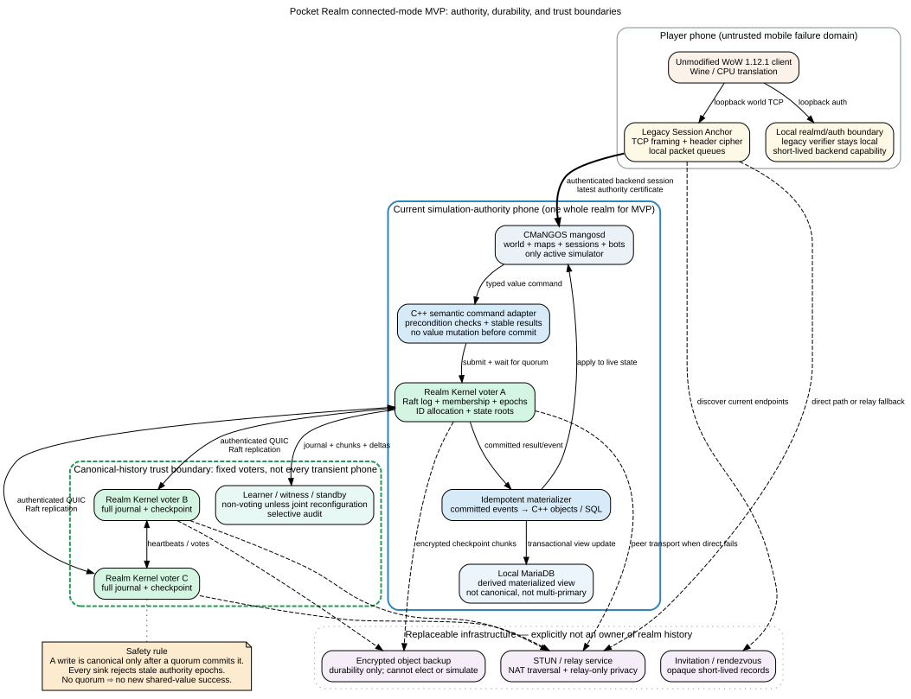

# Pocket Realm Connected/P2P Architecture Investigation

**Research and design report — no implementation**  
**Prepared:** 1 August 2026  
**Target stack:** CMaNGOS Classic, Playerbots, Classic-DB, native MariaDB, ARM64 Android, unmodified WoW 1.12.1 build 5875 client under Wine/translation

## Scope, evidence status, and labels

This report treats the supplied Pocket Realm brief as the governing product specification. It audits the public CMaNGOS baseline `de8f729` and public Playerbots baseline `01c621f`, then evaluates the proposed connected architecture against current protocol, Android, database, and library documentation.

**Important source limitation.** The requested Pocket Realm commits—CMaNGOS `c096bada9e4ed23ad4ca706c67160a26d7121337` and Playerbots `1abeac646f4be02bfb47abcc779f3f9089d67f3e`—were not available in the uploaded material and did not resolve in the public upstream repositories. Therefore:

- the Android/Bionic patch, FetchContent pinning, lifecycle facade, and structured hooks are **not source-verified** here;
- source claims are pinned to the stated public baselines unless explicitly marked otherwise;
- an exhaustive generated call-site inventory of the local Pocket Realm tree remains a mandatory first gate, not something this report can honestly claim to have completed.

The following labels are used throughout:

- **[VERIFIED FACT]** directly supported by pinned source code, an RFC, official documentation, or a current official release page;
- **[INFERENCE]** follows from source structure but still needs a prototype or broader inventory;
- **[RECOMMENDATION]** proposed architecture or policy;
- **[UNRESOLVED EXPERIMENT]** cannot be settled safely without the exact local tree or device measurements;
- **[IMPOSSIBILITY / POLICY TRADEOFF]** a guarantee cannot simultaneously be met under the stated assumptions.

---

# 1. Executive verdict

## 1.1 Feasibility

**[RECOMMENDATION — verdict] Pocket Realm connected mode is feasible as a private or small-community realm in which participant phones may host and replicate the realm, but it is not feasible as an infrastructure-free, continuously writable, hostile-open P2P MMORPG with cryptographically proven honest simulation.**

The technically honest product is:

> A **single-writer, peer-hosted realm** whose active CMaNGOS simulation runs on one elected phone at a time, while a small fixed set of eligible phones replicates a canonical semantic journal, membership history, authority epochs, and checkpoints. Other phones may be clients, learners, standbys, witnesses, checkpoint holders, or relays without automatically becoming voters.

This is P2P in physical placement, transport, replication, and failover. It is **not** multi-writer SQL, independent zone ownership, or permissionless consensus.

## 1.2 Recommended authority granularity

**[RECOMMENDATION] First connected release: one active authority for the entire realm process.**

**[RECOMMENDATION] First plausible later split: a self-contained dungeon or raid instance, and only after global-service ownership, character transfer, group state, IDs, persistence, and session routing have been extracted behind explicit interfaces.**

**[RECOMMENDATION] Reject “one phone per zone.”** A Vanilla continent is a seamless map, not an independently owned server shard. At the pinned baseline, one `WorldRunnable` repeatedly drives one `World::Update`; that update advances sessions, maps, auctions, mail, resets, groups, corpses, world services, Playerbots, and database result queues. `MapUpdater` is local shared-memory multithreading with a barrier, not a distributed worker API. [CM-02] [CM-03] [CM-04]

A continent could become a later authority unit only after global services and cross-map state are separated. That is a substantially larger rewrite than isolated instance hosting.

## 1.3 The three largest blockers in this exact server

1. **No canonical semantic durability boundary.** CMaNGOS frequently mutates live C++ objects first, queues SQL later, and may send success before asynchronous SQL execution and storage commit. `Database::CommitTransaction()` normally enqueues work to the SQL delay thread; the actual database transaction runs later. Trade, mail, auctions, loot, and quest rewards expose concrete crash windows. [CM-07] [CM-08] [CM-11] [CM-12] [CM-13] [CM-14] [CM-15]

2. **One pointer-rich global process.** The world loop, singleton managers, maps, transports, groups, guilds, auctions, mail, bot population, world events, and live object references assume shared memory. Persistent IDs are process-local counters initialized with SQL `MAX(...) + 1`. [CM-03] [CM-04] [CM-09] [CM-16]

3. **Legacy session and transient-state coupling.** `WorldSocket` owns TCP framing/header crypto and points at a `WorldSession`; `WorldSession` maintains separate map/world queues and directly dispatches handlers into live `Player`, `Map`, spell, pet, group, and database state. Preserving the TCP connection is not equivalent to preserving combat or map state. [CM-05] [CM-06]

Playerbots amplify all three blockers: they are in-process simulated players using real `Player`, `WorldSession`, global managers, RNG, wall time, asynchronous login/generation, and direct character-database operations. [PB-02] [PB-03] [PB-04] [PB-05] [PB-06]

## 1.4 Proposed-assumption disposition

| Current hypothesis | Verdict | Required change |
|---|---|---|
| Authenticated QUIC with direct paths and relay fallback | **Retain, layer it correctly** | Treat it only as transport/reachability. It does not provide membership, finality, latest-history selection, or honest simulation. |
| Private invitations and device-bound membership | **Retain** | Use one-use, expiring, audience-bound capabilities and per-realm pseudonymous identities. Hardware keys strengthen key custody, not human uniqueness or gameplay honesty. |
| Rust Realm Kernel ordering durable shared-value operations | **Retain, make it the source of truth** | It must accept semantic commands before CMaNGOS mutates value-bearing state. SQL interception alone is insufficient. |
| One authority per continent or instance | **Change** | Start with one whole-realm authority. Permit isolated instances only after explicit extraction and benchmark proof. |
| Globally canonical economy/progression/session state | **Retain** | Define exact invariants, commit points, ledger/custody models, IDs, clocks, and degraded modes. |
| Idempotency, expected versions, epochs, leases, journals, roots, fencing | **Retain with precise semantics** | Promise “effectively-once semantic result,” not exactly-once packets. Epoch fencing—not leases alone—is the safety mechanism. |
| Legacy Session Anchor | **Narrow for MVP** | Use it as a loopback security/routing boundary. Do not require seamless mid-combat migration initially. |
| Pre-copy + deltas + tick barrier + root comparison | **Postpone to a gated experiment** | Begin with relog/loading-screen handoff, then out-of-combat handoff. Mid-combat handoff is foundational work. |
| Hot standby applying deltas | **Retain cautiously** | Standby may mirror committed state and preload a process, but must never simulate an independent canonical world. |
| Certified dormancy | **Retain, distinguish clean from unclean loss** | A lone last host cannot manufacture a quorum-certified dormant record. |
| Stop and recover on equally certified conflicting roots | **Retain** | Do not merge unique-item or spent-currency histories. |
| One phone per zone | **Remove** | It conflicts with the current world/map/global-service structure and is unlikely to pool WAN CPU efficiently. |
| Writable MariaDB multi-primary | **Reject** | Keep MariaDB local and derived. Canonical history belongs to the journal. |
| Malicious-host resistance through signatures/attestation | **Reject as a security claim** | Signatures attribute; they do not prove kills, RNG, loot, movement, scripts, configuration, or bot decisions were honest. |

## 1.5 Minimum viable connected architecture

The minimum design that preserves a canonical economy without a dangerous CMaNGOS rewrite all at once is:

1. one active, whole-realm `mangosd` authority;
2. a separate Rust Realm Kernel with **three fixed voters** and **2-of-3 crash-fault quorum**;
3. a semantic command adapter introduced operation by operation;
4. a canonical journal and deterministic reducer as source of truth;
5. local MariaDB as an idempotently rebuilt materialized view;
6. at least two complete, failure-domain-diverse checkpoint holders before claiming replicated durability;
7. local realmd/Session Anchor with all legacy listeners on loopback;
8. loading-screen, disconnect/reconnect, or character-relog migration before seamless migration;
9. conservative, economically quarantined bots only on the active simulation authority;
10. minimal replaceable rendezvous/relay infrastructure that never owns realm history.

---

# 2. Exact-stack compatibility audit

## 2.1 Representative source audit

The table below is a **representative high-risk audit** of the pinned public baselines. It is not the required exhaustive inventory of the unavailable Pocket Realm source tree.

| Subsystem | Current behavior at pinned public baseline | Distributed-hosting problem | Required modification | Risk | Relevant source |
|---|---|---|---|---|---|
| `WorldRunnable` | One loop repeatedly calls `sWorld.Update(diff)` | One process owns the global simulation heartbeat | Keep one active world process for MVP; later split only behind explicit authority APIs | Foundational for zone/continent split | [CM-02] |
| `World::Update` | Advances time, mail, auctions, sessions, maps, battleground/PvP managers, groups, corpses, DB callbacks, Playerbots and other services | Multiple processes would duplicate or race global services | Extract single owners for every global service before any multi-`mangosd` design | Very high | [CM-03] |
| `MapUpdater` | Local thread pool, shared queue, condition variables, barrier/wait | No serialization boundary; slow remote worker would enter tick critical path | Do not adapt it directly to WAN. Build a new coarse authority boundary instead | Very high | [CM-04] |
| `WorldSocket` | Owns socket, packet framing, header crypto and session pointer | Backend movement cannot transfer raw socket/cipher object or process pointers | Split legacy front-end connection from backend session transport | Foundational | [CM-05] |
| `WorldSession` | Raw/strong coupling to socket and player; map/world packet queues; handler dispatch | Capsule must capture queues and typed state without pointers/locks | Introduce `IClientTransport`, sequence watermarks, actor/session identity, serializable queues | Foundational | [CM-06] |
| Player object state | Many gameplay effects mutate memory immediately and save later | A second journal beside SQL creates dual-write and crash-order ambiguity | Prepare semantic command before mutation; apply only committed result | Very high | [CM-08] [CM-14] [CM-15] |
| Database abstraction | `Execute()` and `CommitTransaction()` normally enqueue asynchronous SQL; actual transaction occurs later | Enqueue is not a durable or canonical commit point | Journal quorum becomes linearization point; SQL becomes materialization | Very high | [CM-07] |
| Character save | Large delete/reinsert and sub-save transaction assembled after live state has changed | Coarse save cannot explain or validate individual economic causality | Keep periodic save as view maintenance; journal semantic causes separately | High | [CM-08] |
| Persistent IDs | Counters initialized from SQL `MAX(...) + 1` | Two authorities can allocate the same GUID after partition/restore | Kernel allocates non-reusable typed ID ranges; burn unused IDs after failure | High | [CM-09] |
| Item persistence | New item path uses SQL `REPLACE` | Duplicate GUID can overwrite rather than fail closed | Use `INSERT`/versioned update with uniqueness checks; reject duplicate canonical IDs | Critical | [CM-10] |
| Trade | Removes live items, saves inventories/money, queues transaction, then reports completion | Crash can leave client-visible success and SQL/materialized divergence | One atomic semantic trade command with both offers, expected versions, capacity checks, ledger and custody moves | Critical | [CM-11] |
| Mail/COD | Several success packets and memory changes surround queued SQL work | Duplicate attachment/currency, COD split settlement, return/expiry races | Canonical mail escrow state machine and idempotent result | Critical | [CM-12] |
| Auction house | Money/item/auction changes and success paths are not tied to a replicated durable boundary | Split-brain listings, bids, refunds, expiry and settlement; malicious ordering/front-running | Single kernel-owned auction command order and escrow ledger; one timer owner | Critical | [CM-13] |
| Loot | Item and money rewards are applied to live player state and client notifications | Duplicate/replayed loot and rare-spawn provenance cannot be inferred from SQL alone | Canonical loot entitlement/claim command keyed by spawn/container/slot/roll | Critical | [CM-14] |
| Quest rewards/progression | Items, reputation, XP, money, mail and status are updated in one large live path | Partial or duplicated progression across failover | Canonical reward bundle with checked range, expected quest state and stable result | Critical | [CM-15] |
| Groups/guilds/social/global chat | Global managers and live player/session references | Cross-authority membership and communication need one owner and routable identities | Keep global ownership in whole-realm process; later extract durable membership service | High | [CM-03] [CM-08] |
| Transports | Passenger sets contain live pointers; transports move passengers across maps | A transport crosses proposed zone/map authorities with pointer-rich state | Keep all affected maps in one authority or redesign transport as a durable actor | Very high | [CM-16] |
| RNG and clocks | Wall time and non-central RNG are widespread | Deterministic full replay is not available; suspend/reboot changes behavior | Journal semantic outcomes, define realm clock domains, snapshot relevant RNG only for scoped handoff | Very high | [CM-03] [CM-08] [PB-04] [PB-05] |
| Playerbot login | Asynchronous holders create/login real bot players and sessions | In-flight login/generation jobs are migration state; direct DB dependencies | Bots run only on active authority; drain/cancel jobs at barriers | High | [PB-02] |
| Playerbot manager/AI | Uses real `Player`, `WorldSession`, opcode queues and global managers | Not a clean remote AI service; delegated execution can diverge | Treat remote AI only as untrusted suggestion; authority validates and applies | High | [PB-03] [PB-04] |
| RandomPlayerbot manager | Uses wall time, RNG, teleport/population logic and direct database work | Different hosts produce divergent bot worlds and economic actions | Disable autonomous economic population for MVP; journal any retained bot lifecycle | High | [PB-05] |
| Playerbot DB store | Direct character-database queries/inserts/deletes | Bypasses kernel unless explicitly wrapped | Inventory and replace all direct writes in connected build | High | [PB-06] |
| LLM integration | Pinned baseline defaults show LLM enabled, long timeout and high concurrency | External egress, nondeterminism, secrets, hangs, cost and migration ambiguity | Compile/configure off in connected mode; no API keys replicated | High | [PB-07] |
| Playerbot command server | Optional TCP server accepts commands; pinned code binds an IPv4 any-address socket and does not authenticate commands | Internet exposure becomes remote command execution surface | Remove from connected release, not merely set port zero | Critical if enabled | [PB-08] |
| AHBot | Autonomous auction behavior, money, mail, RNG/time and DB activity | Directly manipulates canonical economy and prices | Disable; any future market maker must be a bounded kernel actor with explicit policy | Critical | [PB-09] |
| Legacy listeners | Distributed configs default mangosd and realmd bind IPs to `0.0.0.0`; optional RA/SOAP/admin surfaces exist | Accidental exposure of legacy protocols, DB or admin channels | Generated config and runtime assertions must bind all legacy/admin/DB sockets to loopback/UDS | Critical | [CM-17] [CM-18] |
| Character schema | Primary keys exist, but character/guild names are not universally enforced as canonical normalized unique keys; some historical tables use non-transactional engines | Cross-authority name races, weak custody proof and inconsistent transactional behavior | Add canonical normalized-name reservation; migrate canonical view tables to tested InnoDB constraints | High | [CM-19] |
| Anticheat/Warden assumptions | The audited source does not provide a trustworthy basis for translated-client memory attestation as the main defense | Wine/translation and compromised phones make memory inspection brittle, invasive and spoofable | Prioritize server-side movement, timing, spell, inventory and economy invariants | High residual risk | [CM-20] |

## 2.2 Why SQL interception alone fails

**[VERIFIED FACT]** `Database::CommitTransaction()` releases the current transaction into the asynchronous delay queue and returns; the SQL worker later executes `BEGIN`, statements, and `COMMIT`. [CM-07]

**[VERIFIED FACT]** representative gameplay paths mutate live player/item/money state or send success around that queueing boundary. [CM-11] [CM-12] [CM-13] [CM-14] [CM-15]

**[INFERENCE]** A database proxy or patched `CommitTransaction()` can record SQL text, but it cannot reliably reconstruct the semantic command, pre-mutation state, client-visible result, provenance, or in-memory effects that occurred before the SQL was issued. It also cannot convert unrelated SQL statements into a safe atomic ownership transition without gameplay-specific knowledge.

Therefore the safe interception point is **above SQL and before value mutation**, at typed gameplay command boundaries.

## 2.3 Mandatory generated inventory for the exact Pocket Realm tree

The local tree must produce machine-readable CSV/JSON inventories in CI. Required columns should include:

`symbol`, `file`, `line`, `subsystem`, `mutation_type`, `entity_types`, `database`, `SQL_kind`, `transaction_scope`, `memory_before_SQL`, `client_response_before_commit`, `ID_allocator`, `wall_clock`, `RNG`, `async_callback`, `listener_or_egress`, `connected_mode_owner`, `kernel_command`, `review_status`.

The inventory generator should combine:

1. a compilation database and Clang AST/call-graph pass;
2. lexical discovery of `CharacterDatabase`, `LoginDatabase`, `WorldDatabase`, `BeginTransaction`, `CommitTransaction`, `DirectExecute`, prepared statements and raw SQL;
3. packet/result send sites in the same call graph as mutations;
4. assignments to money, inventory, item ownership, quest/progression, cooldowns, lockouts, mail, auction, guild/group and session state;
5. singleton/global-manager references;
6. GUID/ID counter initialization and increment sites;
7. `time`, `getMSTime`, `urand`, random engines and wall-clock comparisons;
8. futures, result queues, detached threads, map-worker queues and bot jobs;
9. every `bind`, `listen`, outbound HTTP/TCP/UDP client, SOAP/RA/metrics/LLM endpoint and database socket.

**Acceptance gate:** connected mode must fail CI when a new canonical mutation or direct write appears without an ownership classification and test.

## 2.4 Order-of-magnitude modification burden

These are relative engineering footprints, not calendar estimates or promises:

| Change | Likely affected footprint | Rewrite/merge risk |
|---|---:|---|
| Listener lockdown, connected config profile, egress deny-list | 5–20 files | Low |
| Host telemetry and supervisor hooks | 10–30 Kotlin/C++/Rust files | Low–medium; local lifecycle patch unknown |
| One semantic durability pilot, such as vendor purchase or mail gold | 10–25 C++ files plus new Rust API | Medium |
| Kernel, membership, journal, checkpoint and transport core | 30–80 new Rust/Kotlin files | Medium–high, mostly isolated from upstream |
| Central ID/name/session reservation | 15–40 C++/Rust/schema files | High |
| Complete human economy/progression conversion | Approximately 80–180 C++ files across handlers/entities/managers | Very high and ongoing |
| MariaDB deterministic materializer/rebuild | 20–60 C++/Rust/schema files | High |
| Isolated instance authority | More than 100 core C++ files/interfaces is plausible | Foundational |
| Seamless mid-combat/session migration | 100–300+ core files and protocol-state interfaces is plausible | Foundational, highest upstream-merge burden |

**[UNRESOLVED EXPERIMENT]** Exact file and patch counts require the local Pocket Realm commits and generated inventory. The estimates above are deliberately ranges, based on the observed cross-cutting ownership and call patterns.

---

# 3. Recommended architecture

## 3.1 Trust profiles

### Profile A — practical trusted-friends/private-realm MVP

| Question | Decision |
|---|---|
| Who may host? | Explicitly approved members whose devices meet compatibility, consent and resource gates |
| Who may vote? | Three pinned voter devices/keepers; transient players are learners by default |
| Who stores full snapshots? | At least two voters in distinct practical failure domains; optional encrypted cloud copy |
| One online phone | Default: read-only/recovery or dormant. Optional **trusted-solo** progression is a realm policy and is not quorum-durable |
| Malicious-host gameplay | Not preventable; selective inconsistencies may be detected and signatures may attribute the signer |
| Central/semi-central services | Replaceable rendezvous and relay; optional backup storage; none own history |
| Honest product claim | “Peer-hosted private realm with replicated canonical history when quorum is available” |
| Claims to avoid | “Cheat-proof,” “always online,” “fully decentralized,” or “no trusted host” |

**Verdict:** feasible and the recommended MVP.

### Profile B — stronger small-community realm

| Question | Decision |
|---|---|
| Who may host? | Host allow-list plus compatibility/attestation signals and reputation |
| Who may vote? | Three or five long-lived, administratively approved voters spread across households/ISPs |
| Full snapshots | Three complete holders preferred; periodic encrypted external backup |
| One online phone | No canonical progression unless policy explicitly accepts a trusted-single-host risk |
| High-value operations | Independent witness submission, stricter audit, provenance and moderator review |
| Malicious-host gameplay | Still not cryptographically prevented; fabrication can remain undetectable if semantically plausible |
| Central/semi-central services | A community keeper/notary may be justified for availability and latest-head recovery |

**Verdict:** feasible, with higher governance and privacy burden. The keeper/notary should be described honestly as semi-central infrastructure.

### Profile C — open hostile community

An arbitrary sole phone can fabricate movement, kills, RNG, loot, XP, quest completion, vendor prices, bot actions, configuration and event timing. Honest replicas can validate ledger shape and authorization, but they cannot infer whether the underlying simulation event was true.

**[IMPOSSIBILITY / POLICY TRADEOFF]** An open hostile realm needs one of the following:

- managed/trusted simulation hosts;
- redundant deterministic or verifiable simulation of relevant gameplay;
- witnesses observing enough inputs/state to re-execute high-value outcomes;
- or acceptance that host cheating is only attributable/auditable, not prevented.

Retrofitting full deterministic redundant simulation into this CMaNGOS/Playerbots baseline is disproportionate and likely worse than operating a small hosted authority.

**Verdict:** reject a strict phone-only hostile-open promise. Offer a managed-host profile or do not market this trust model.

## 3.2 Component and trust-boundary diagram



A separate scalable SVG and PNG accompany this report.

## 3.3 Components

### Unmodified client and local legacy boundary

- The user-supplied WoW client speaks only loopback TCP to local realmd and the Session Anchor.
- Reusable legacy account verifier/session material stays on the player’s local device where possible.
- After local authentication, the Anchor receives a short-lived, realm-scoped backend capability binding account, character, device/session, expiry and allowed authority epoch.
- The client-facing socket, header cipher and packet framing remain local. No public peer receives a raw legacy password or a reusable realm-login secret.

### Active CMaNGOS simulation authority

- Exactly one `mangosd` process is active for the whole realm in the MVP.
- It owns maps, world tick, sessions, bots and transient simulation.
- It may not commit value-bearing outcomes by writing SQL directly.
- A connected-build semantic adapter submits typed commands to the Realm Kernel and waits for a stable result.

### Realm Kernel

The Rust Realm Kernel owns:

- voter membership and joint reconfiguration;
- canonical command ordering and idempotency results;
- authority grants, epochs, source fencing and session ownership;
- globally non-reusable IDs and normalized name reservations;
- currency ledger, item custody and other value/progression transitions;
- canonical clock transitions and bounded dormancy catch-up;
- journal indices, semantic state roots and checkpoint manifests;
- moderation, membership, key rotation, freeze and recovery operations.

It does **not** run the CMaNGOS world tick or claim to validate arbitrary combat truth.

### MariaDB materialized state

- One local MariaDB belongs to each active/standby materializer.
- It is a derived view used by legacy CMaNGOS queries and local recovery.
- Only committed events update canonical view tables.
- A materializer records the last applied journal index and event hash in the same local SQL transaction as the view change.
- On mismatch or failed application, the affected entity or realm freezes; it is rebuilt from checkpoint plus journal rather than inventing compensation.
- No writable SQL multi-primary is used.

### Voters, learners, witnesses and standbys

- Voters store full log/state needed to decide canonical history.
- Learners replicate but do not vote.
- A standby may keep a warm MariaDB/materialized view and optionally a preloaded `mangosd`, but it does not advance the world independently.
- Witnesses can independently receive player submissions or replay selected high-value operations. They improve evidence and censorship detection; they do not prove all simulation outcomes.

### Discovery, relays and backup storage

- Rendezvous records advertise short-lived endpoints; they do not authorize membership.
- STUN/relay infrastructure supplies reachability and privacy modes; it does not vote or hold canonical authority.
- Encrypted cloud/object storage improves data durability only. It cannot simulate, discover the newest history by itself, or issue a new epoch.

## 3.4 Core request path

For a canonical value-bearing operation:

1. Anchor/session adapter derives a stable operation identity from the authenticated session and request context.
2. CMaNGOS validates cheap syntax and gathers immutable expected versions, but does not mutate value.
3. Adapter submits a bounded semantic command to the current Kernel leader.
4. Kernel validates authority epoch, membership, idempotency, versions, ledger/custody invariants and policy.
5. A voter quorum commits the command and deterministic result at log index `i`.
6. Active materializer applies event `i` to live C++ state and local MariaDB idempotently.
7. Only then does CMaNGOS send the stable success/result packet to the client.
8. A retry with the same idempotency key returns the same semantic result even if the original response was lost.

The linearization point is **quorum commit**, not packet receipt, SQL enqueue, local SQL commit, or checkpoint publication.

## 3.5 Authority units by stage

| Unit | MVP decision | Reason |
|---|---|---|
| Whole realm process | **Use** | Fits current global world loop and managers with least dangerous rewrite |
| Dungeon/raid instance | **Later candidate** | Natural loading boundary and limited participants, but still needs character/group/economy/global-service extraction |
| Battleground | **Later candidate/likely disabled for PvE product** | Similar isolation potential but global queues/rewards must be owned |
| Continent | **Postpone** | Seamless map plus transports/global events/bots; migration payload is large |
| Zone | **Reject** | No independent process boundary; cross-zone visibility/travel/global services and WAN tick cost |
| Global economy service | **Use as Kernel state machine** | Small durable commands are suitable for replication; real-time simulation is not |
| Fine map-update worker | **Reject over WAN** | Pointer-rich shared state, barrier synchronization and low latency budget |


---

# 4. Authority and host-selection design

## 4.1 Separate consensus leadership from simulation placement

A Raft leader orders Kernel commands. A simulation host runs CMaNGOS. They may be the same phone, but they are different roles and should be elected independently.

Reasons:

- the strongest simulation phone may be a poor long-lived voter;
- a voter can be a charging keeper with weak gameplay latency;
- changing simulation placement should not churn the consensus configuration;
- transient player phones should not become voters merely by logging in;
- consensus membership changes need joint consensus and administrative policy, while simulation placement can happen comparatively often.

## 4.2 Measured inputs and verification

### Hard eligibility inputs

A candidate is ineligible unless all of these are true:

- exact compatible build/protocol/schema/policy/content vector;
- current realm membership and explicit host permission;
- user consent allows the current network, charging, background and data conditions;
- validated network path to the voter quorum and affected players;
- enough RAM and storage for active state plus migration/checkpoint reserve;
- no severe thermal state or recent sustained throttling;
- no app force-stop, update-pending, key-invalid or database-recovery condition;
- a complete committed state at or beyond the unit’s required base index;
- no unresolved integrity mismatch, stale epoch or revocation.

### Who measures claims?

| Claim | Primary measurement | Verification |
|---|---|---|
| CPU/tick capacity | Fixed native benchmark plus observed CMaNGOS p95/p99 tick debt | Signed benchmark manifest; compare claimed capacity with live tick metrics |
| RAM | Android/process metrics and allocator high-water marks | Supervisor reports; peers only need pass/fail plus coarse bucket for privacy |
| Thermal | Android thermal status and trend | Local OS signal; cross-check with tick-frequency collapse |
| Battery/charging | Android battery state | Self-reported but enforced by local supervisor; lying mainly harms the liar unless rewards exist |
| Reachability/NAT | Actual connection attempts over IPv6, IPv4, direct QUIC and relay | Peer-observed; never trust a NAT label alone |
| Upload/loss/jitter/latency | Active probes and live traffic telemetry | Affected peers sign short-lived measurements; use median/winsorized samples |
| Stability | Crash/kill/lease-loss history in canonical telemetry | Kernel records host tenure and failure events |
| Storage | Local free space and write test | Local enforcement plus periodic checkpoint completeness challenge |
| Compatibility | Signed manifests and protocol negotiation | Every voter verifies before granting authority |
| Trust tier | Membership/governance state | Canonical membership operation, not self-report |

Dishonest self-reported capability is handled by making **observed behavior** dominate the score. Self-report is used mainly for privacy/consent and local capacity gates. Hosting should not award tradable game value; otherwise users gain incentives to fake telemetry, create Sybils, and damage their own devices.

## 4.3 Initial eligibility thresholds

These are deliberately measurable starting gates, not universal truths. Device pilots must tune them.

| Input | Initial gate |
|---|---:|
| Battery | At least 40% unless charging; initiate normal migration at 25%; emergency stop/migrate at 15% |
| Thermal | Eligible at `NONE/LIGHT/MODERATE` only; drain bots at sustained `MODERATE`; migrate at `SEVERE` or sustained tick collapse |
| RAM reserve | Measured peak active working set + 25%, with at least 1.5 GiB additional headroom after Wine/client load |
| Storage reserve | Greater of 2× latest full checkpoint + 5 GiB, or 20% of the app storage volume |
| Network | Android `VALIDATED`; direct or relay path to quorum; p95 loss below 2%; upload headroom at least 2× observed realm traffic |
| Tick health | p95 tick debt below 20% and p99 below 50% during a 5-minute qualification load |
| Stability | 30 minutes crash-free before elective promotion; longer history improves score |
| State readiness | Complete checkpoint plus journal caught up to current commit index; semantic root matches |

**[UNRESOLVED EXPERIMENT]** The actual CMaNGOS+MariaDB+Playerbots working set and tick limits on representative ARM64 phones must be measured. The thresholds above are release-gate defaults, not evidence that every supported phone can host.

## 4.4 Scoring function

Only eligible hosts are scored. Normalize each component to `0..1`, where 1 is best:

```text
score(host, unit, players) =
    0.30 * affected_player_network_quality
  + 0.25 * sustained_tick_capacity
  + 0.15 * thermal_headroom_and_trend
  + 0.10 * memory_headroom
  + 0.08 * recent_stability
  + 0.05 * energy_state
  + 0.04 * storage_and_checkpoint_reserve
  + 0.03 * trust_and_failure_domain_diversity
  - migration_cost_penalty
  - metered_or_roaming_penalty
  - current_client_load_penalty
```

`affected_player_network_quality` should combine p50 and p95 latency, jitter and loss to the players who will use that authority—not a global average. Suggested internal formula:

```text
network_quality =
    0.45 * latency_score(p50)
  + 0.30 * latency_score(p95)
  + 0.15 * jitter_score(p95)
  + 0.10 * loss_score
```

For a dungeon/raid instance, the affected party’s p95 latency receives most of the network weight. For the whole realm, use all active players with a cap so one pathological route does not fully dominate; still reject a host whose worst regional cohort exceeds the configured playability threshold.

### Strongest device versus nearest party

- **Whole realm:** favor sustained capacity and p95 latency to all players. A powerful phone with poor paths to half the realm should lose.
- **Instance:** favor latency to that party/raid after minimum capacity is met.
- **Bots/background:** place only after human latency and host safety; bots are shed before humans are migrated.
- **Checkpoint/witness:** favor storage, reliability and failure-domain diversity rather than player latency.

## 4.5 Hysteresis and flapping control

Recommended starting policy:

- elective migration requires at least **20% score improvement**;
- candidate must maintain that advantage for **5 minutes**;
- normal minimum host tenure is **30 minutes**;
- a former host has a **15-minute cooldown** before another elective promotion;
- at most one elective migration per authority unit per **30 minutes**;
- urgent conditions—thermal severe, battery emergency, user revokes hosting, imminent update, storage critical—bypass tenure but still require a quorum-certified higher epoch;
- repeated failed candidates receive an exponentially increasing cooldown;
- migration proposals have a realm-wide token bucket so a member cannot drain batteries by forcing elections.

## 4.6 Epochs, leases and fencing

### Safety mechanism

The safety guarantee is an **authority epoch enforced at every canonical sink**:

- each authority command carries `(unit_id, authority_epoch, lease_id, session_id)`;
- the Kernel accepts only the active authority certificate committed in the current membership configuration;
- materializers and Anchors reject stale epochs;
- a higher committed epoch permanently fences every lower epoch;
- an old host returning from partition cannot write, even if it still believes it is active.

### Lease semantics

A short lease improves liveness and limits stale traffic, but time-based leases alone are unsafe without bounded clock assumptions. Use leases as follows:

- quorum commits an authority grant with a unique lease ID and epoch;
- each voter issues renewal evidence using its own monotonic timer;
- host renews every **4 seconds** for a nominal **12-second** lease;
- host must self-quiesce before its local renewal deadline;
- Anchors stop routing to a host whose latest certificate/renewal is expired;
- Kernel epoch checking remains the final safety boundary even if clocks drift.

No client success may rely solely on “the lease probably expired.” It must be accepted by the current Kernel epoch.

## 4.7 State machines

### Authority state

```text
UNASSIGNED
  -> PREPARING(target, epoch+1, base_index)
  -> QUIESCING(source, barrier_index)
  -> SEALED(epoch, barrier_index, semantic_root)
  -> GRANTED(target, epoch+1)
  -> ACTIVE(target, epoch+1)
  -> DRAINING
  -> CLEAN_DORMANCY

Crash/partition paths:
ACTIVE -> UNCLEAN_NO_AUTHORITY -> RECOVERY -> GRANTED(epoch+1) -> ACTIVE
ACTIVE -> DEGRADED_SINGLE_SURVIVOR or READ_ONLY_RECOVERY when no quorum
```

### Host eligibility pseudocode

```text
function eligible(h, unit, now):
    if not h.member.host_allowed: return false
    if not h.user_consent.allows(current_network, charging, background): return false
    if h.compatibility_vector != unit.required_vector: return false
    if h.revoked or h.key_invalid or h.integrity_quarantined: return false
    if not h.network.validated: return false
    if not h.can_reach_quorum: return false
    if h.state_index < unit.required_index: return false
    if h.state_root != unit.required_root: return false
    if h.battery < 40% and not h.charging: return false
    if h.thermal >= SEVERE: return false
    if h.free_ram < measured_peak * 1.25 + migration_reserve: return false
    if h.free_storage < max(2 * checkpoint_size + 5GiB, 20% volume): return false
    if h.p95_loss >= 2%: return false
    if h.p95_tick_debt >= 20% during qualification: return false
    if now - h.last_crash < 30min: return false
    return true
```

### Selection and elective migration pseudocode

```text
function choose_candidate(unit, hosts, affected_players):
    candidates = [h for h in hosts if eligible(h, unit, now)]
    if candidates.empty: return NONE
    return argmax(candidates, score(h, unit, affected_players))

function should_migrate(current, candidate, unit):
    if candidate == NONE or candidate == current: return false
    if urgent_safety_trigger(current): return true
    if now - current.activation_time < 30min: return false
    if now - unit.last_elective_migration < 30min: return false
    if now - candidate.last_host_exit < candidate.cooldown: return false
    if candidate.score < current.score * 1.20: return false
    if candidate.advantage_duration < 5min: return false
    return true
```

### Planned migration pseudocode

```text
function migrate(unit, source, target):
    require quorum_available()
    require eligible(target, unit, now)

    prepare = kernel.commit(PrepareAuthority(
        unit, target, source.epoch + 1,
        base_index = kernel.commit_index,
        compatibility = unit.required_vector))

    target.install_checkpoint_and_stream_deltas(prepare.base_index)
    require target.semantic_root == source.semantic_root_at(target.applied_index)

    source.stop_new_admissions_and_value_commands()
    barrier = source.reach_safe_tick_barrier()
    source.flush_pending_kernel_commands_through(barrier.command_index)

    seal = kernel.commit(SealAuthority(
        unit, source.epoch,
        barrier.command_index,
        barrier.semantic_root))

    require target.catch_up_to(seal.command_index)
    require target.semantic_root == seal.semantic_root
    require target.process_ready

    grant = kernel.commit(GrantAuthority(
        unit, target,
        epoch = source.epoch + 1,
        base_index = seal.command_index,
        root = seal.semantic_root,
        lease_id = random128()))

    // Grant atomically fences every lower epoch at the Kernel.
    anchors.route_only_with(grant.certificate)
    target.activate(grant)
    source.destroy_or_quarantine_old_authority_context()
```

If target dies after the grant but before useful activation, the quorum issues a new grant at `epoch+2`; it never revives the old epoch.

### Failure promotion pseudocode

```text
function promote_after_failure(unit):
    if not quorum_available():
        enter_read_only_or_dormant(unit)
        return

    head = quorum.certified_committed_head()
    candidates = replicas_matching(head.index, head.root, compatibility)
    target = choose_candidate(unit, candidates, affected_players)
    if target == NONE:
        freeze(unit, reason = NO_QUALIFIED_AUTHORITY)
        return

    grant = kernel.commit(GrantAuthority(
        unit, target,
        epoch = unit.last_epoch + 1,
        base_index = head.index,
        root = head.root,
        lease_id = random128()))
    target.activate_from_committed_head(grant)
```

### Renewal pseudocode

```text
function renew(authority):
    evidence = authority.health_report(
        epoch, lease_id, applied_index, semantic_root,
        tick_debt, thermal, memory, battery, network)
    if not eligible_for_renewal(evidence): reject
    return quorum.commit_or_sign(RenewLease(epoch, lease_id, health_digest))
```

## 4.8 Degraded modes

| Condition | Allowed behavior |
|---|---|
| Quorum available, no standby | Continue while host remains healthy; disable new heavy instances and bot growth; prioritize checkpoint reserve |
| Quorum lost, active host still reachable | Default: freeze canonical value writes and begin graceful disconnect/dormancy. Optional private trusted-solo policy must label outcomes non-quorum until later accepted or discarded; recommended MVP does not auto-promote them |
| One stale survivor | Read-only recovery UI; no authority grant, no auctions/mail expiry/catch-up, no declaration of latest history |
| No qualified simulation host but quorum exists | Kernel remains available; realm is administratively frozen until an eligible host appears |
| Relay lost but direct path exists | Continue direct; advertise changed reachability |
| Direct paths lost but relay exists | Continue with relay and reduce bulk/checkpoint traffic |
| No complete second checkpoint replica | Do not claim replicated durability; may continue only under explicit degraded policy and prominent warning |

## 4.9 0–5 eligible-replica availability and finality matrix

The count of online phones is not enough; their roles matter. The matrix below assumes the recommended **fixed three-voter configuration**, with extra phones as full learners/standbys. It also assumes the relevant gameplay subsystem has already been converted to semantic commands.

Legend: `✓` canonical and quorum-committed; `RO` read-only/recovery; `—` unavailable; `P` policy-gated and normally prohibited; `D` durability/availability improvement only.

| Eligible online full replicas | Commit quorum | Ordinary gameplay | Durable progression / loot / XP | Trade / mail / COD / auctions | Bot economic activity | Authority migration | Membership change | Software upgrade | Disaster recovery | Additional crash tolerance | Byzantine simulation tolerance |
|---:|---:|---|---|---|---|---|---|---|---|---:|---:|
| 0 | none | — | — | — | — | — | — | — | Depends on stored backups when devices return | 0 | 0 |
| 1 | no 2-of-3 quorum | RO; optional trusted-solo `P` | RO / `P` | — | — | — | — | — | Can inspect local snapshot but cannot prove it is newest | 0 | 0 |
| 2 | 2 | ✓ | ✓ | ✓ | Disabled in MVP | ✓ if target is ready | Technically possible, but policy-freeze emergency shrink | No normal rolling upgrade; require safer replica threshold | ✓ from certified head, but no further failure margin | 0 additional voter failures | 0 |
| 3 | 2 | ✓ | ✓ | ✓ | Disabled in MVP | ✓ | ✓ through joint consensus and governance | ✓ with pre-upgrade checkpoint and compatibility gate | ✓ | 1 voter crash | 0 |
| 4 | 2 of the fixed 3 | ✓ | ✓ | ✓ | Disabled in MVP | ✓; extra standby improves target choice | ✓ | ✓ | `D`: extra full copy | Same consensus tolerance; better data availability | 0 |
| 5 | 2 of the fixed 3 | ✓ | ✓ | ✓ | Disabled in MVP | ✓ | May jointly move to 5 voters if policy requires | ✓ | `D`: two extra copies/failure domains | 1 voter crash until reconfigured; 2 after a completed 5-voter config with quorum 3 | 0 |

A five-voter configuration commits with 3-of-5 and tolerates two crash failures, but small phone realms may frequently lack three voters. Do not automatically expand every online phone into the voter set.

**No automatic 3→2→1 quorum shrink.** Reconfiguration is a canonical operation using joint consensus. Removed devices returning later remain fenced by membership/configuration epochs and key revocation.

**Raft Byzantine tolerance is zero.** A malicious leader or malicious majority is outside Raft’s crash-fault assumptions. Even honest followers cannot reject a semantically valid but fabricated “boss died and dropped item X” claim unless they independently observed or verified the simulation. [CONS-01]

## 4.10 Formal safety model

A small TLA+ abstraction accompanies this report as `PocketRealmAuthority.tla` with a TLC configuration. It models:

- fixed and joint voter configurations;
- quorum-certified authority grants;
- monotonically increasing authority epochs;
- stale-epoch fencing;
- semantic command commits;
- certified checkpoints;
- clean dormancy and unclean recovery;
- quorum-required first-peer recovery.

The primary invariants are:

1. one accepted writer per authority epoch;
2. no semantic command without the currently granted epoch/host;
3. authority epoch never falls behind the fenced-through epoch;
4. clean dormancy has no active host and references a certified checkpoint at the committed head;
5. reconfiguration passes through joint majorities, never an instantaneous unsafe switch.

**[UNRESOLVED EXPERIMENT]** The supplied model is an unexecuted design artifact in this environment. C04 should run TLC over 3-node and 5-node models with crash/recovery, message loss, partitions, stale backups, joint reconfiguration, and dormancy actions. It does not model Byzantine voters or CMaNGOS simulation correctness.

---

# 5. Durable-state and canonical-economy design

## 5.1 Canonical invariants

The connected realm must continuously enforce at least these invariants:

1. **Canonical prefix:** two quorum-certified committed histories cannot disagree at the same configuration/term/index under crash-fault assumptions.
2. **Writer fence:** every canonical mutation is authorized by the current authority epoch for its unit.
3. **Stable result:** one idempotency key has one immutable semantic result.
4. **Currency balance:** every currency change is balanced between explicit accounts, including named mint/source and sink accounts.
5. **Item custody:** an item or stack quantity has one valid custody state and version; transfers are atomic.
6. **Non-reusable IDs:** character, item, auction, mail, guild, entitlement and command IDs are never silently reused after rollback or failed allocation.
7. **Single character session:** one character can have at most one canonical active-session lease.
8. **Versioned entities:** every command names expected entity versions; stale operations fail without partial effects.
9. **Deterministic view:** a checkpoint plus committed suffix rebuilds the same semantic state root on compatible software.
10. **Canonical time:** realm-time transitions and dormancy catch-up are explicit committed events and execute once.
11. **Duplicate IDs fail closed:** no canonical asset insert may use SQL `REPLACE` or overwrite an unrelated row.
12. **Checked arithmetic:** money, quantities, XP and counters use checked wider intermediate arithmetic and explicit legacy-range validation.

## 5.2 Source-of-truth decision

### Rejected: MariaDB as the canonical distributed source

Remote SQL or writable multi-primary does not solve gameplay-ordering, in-memory mutation, client acknowledgments, global IDs, malicious hosts, or semantic replay. It also conflicts with the project prohibition on writable multi-primary.

### Rejected: a side journal populated after legacy SQL

This creates a dual-write system. A crash may leave:

- live memory changed but neither SQL nor journal committed;
- journal committed but memory/SQL not applied;
- SQL queued but journal missing;
- client success sent while only one side exists.

### Recommended: journal as canonical source, MariaDB as derived view

The Realm Kernel’s deterministic reducer is the authoritative state machine for durable shared-value state. MariaDB remains an important compatibility and query view, but it can be rebuilt or checked against the journal.

This is not full deterministic replay of CMaNGOS. The reducer covers durable semantics—ownership, balances, entitlements, progression, sessions, membership, clocks—not every movement spline or combat tick.

## 5.3 Semantic command format

A command should contain bounded, typed fields such as:

```text
Command {
  realm_id
  authority_unit_id
  authority_epoch
  authority_lease_id
  compatibility_vector_hash
  command_schema_version

  actor_member_id
  actor_account_id
  actor_character_id
  actor_session_id
  command_type
  idempotency_key_128

  expected_entity_versions[]
  referenced_entitlement_ids[]
  logical_request_time
  bounded_payload
  policy_hash
  authority_signature
}
```

The Kernel rejects unknown writers, stale epochs, incompatible policy, oversized payloads, missing expected versions, arithmetic overflow and duplicate/conflicting idempotency keys.

### Idempotency scope

Recommended scope:

`(realm_id, actor_session_id or actor_character_id, command_type, 128-bit key)`.

- The Anchor/adapter creates the key because the Vanilla protocol has none.
- The result table stores command digest, stable result code, allocated IDs and response data.
- A key reused with a different command digest is a protocol violation and is rejected.
- Results survive checkpoint and compaction.
- Non-reusable entitlement and ownership records remain permanent or tombstoned.
- Ordinary idempotency result bodies may be compacted after a policy window—initially 90 days or 10 million commands—but the command digest, terminal status and any allocated IDs must remain sufficient to prevent reuse.

The guarantee is **effectively-once semantic result**. Packets may be duplicated, delayed or lost.

## 5.4 Event/result format

```text
CommittedResult {
  configuration_epoch
  raft_term
  commit_index
  command_digest
  idempotency_key
  stable_result_code
  stable_result_payload

  allocated_ids[]
  ledger_entries[]
  item_custody_transitions[]
  progression_transitions[]
  session_transitions[]
  entity_version_updates[]
  canonical_time_updates[]

  previous_semantic_root
  new_semantic_root
  voter_certificate
}
```

Hash a normalized semantic representation, not raw protobuf bytes whose unknown fields or map ordering may differ. Unknown event fields must be preserved by compatible replicas even when not interpreted.

## 5.5 Exact acknowledgment and crash boundaries

For every value operation, record these stages:

1. CMaNGOS pre-validation and immutable intent preparation;
2. Kernel local append;
3. quorum replication and commit;
4. committed-result return to adapter;
5. live C++ application;
6. MariaDB materializer transaction and local fsync policy;
7. client response;
8. checkpoint publication.

### Linearization rule

- **Canonical commit:** stage 3.
- **Client success:** no earlier than stage 7, after stage 3 and successful active materialization.
- **Checkpoint:** improves recovery/compaction but is not the operation’s commit point.

### Crash outcomes

| Crash point | Canonical outcome | Recovery action |
|---|---|---|
| Before local append | No operation | Client may retry with same/new request context |
| After local append, before quorum | Uncommitted tail | New leader overwrites/discards; no success returned |
| After quorum, before C++/SQL apply | Operation is canonical | Replay committed result into materializer |
| After C++ apply, before SQL transaction | Canonical; live view dirty | Freeze/restart process and reapply from last materialized index |
| After SQL commit, before client reply | Canonical | Retry returns same stable result |
| After client reply, before checkpoint | Canonical | Recover from journal; checkpoint lag is acceptable |
| Canonical commit followed by permanent materializer failure | Canonical history retained | Stop dependent gameplay; rebuild a fresh view; never compensate silently |

## 5.6 Transitional CMaNGOS adapter strategy

Converting the entire server at once is too risky. Build **canonical command islands**:

1. choose one operation with clear input/output and value effects;
2. refactor it into `Prepare`, `Commit`, `Apply`, `Respond` phases;
3. prohibit legacy SQL writes for the entities owned by that island;
4. build reducer, materializer and crash tests;
5. expand to adjacent operations sharing the same entities.

Suggested conversion order:

1. canonical ID allocation and character-session lease;
2. vendor purchase/sale and money ledger;
3. item creation/destruction/stack operations;
4. loot claims and quest reward bundles;
5. two-party trade;
6. mail/COD escrow;
7. auction escrow/bidding/settlement;
8. guild/group/lockout/progression and global timers;
9. bot assets, only if they remain in the connected product.

Until an entity is covered, it must not be exposed to connected multi-host progression. A mixed system in which some handlers can silently bypass the Kernel is not safe.

## 5.7 Currency: double-entry model

Use explicit accounts rather than “set character money to X.” Example account classes:

- `CHARACTER_WALLET(character)`;
- `TRADE_ESCROW(trade_id, side)`;
- `MAIL_ESCROW(mail_id)` and `COD_ESCROW(mail_id)`;
- `AUCTION_DEPOSIT(auction_id)`, `AUCTION_BID(auction_id, bidder)`, `AUCTION_PROCEEDS(auction_id)`;
- `VENDOR_STOCK/VENDOR_SINK(vendor_id)`;
- `REPAIR_SINK`, `TRAINER_SINK`, `TAXI_SINK`, `RESPEC_SINK`;
- `QUEST_MINT(quest_id)`, `LOOT_MINT(spawn_id, loot_instance)`, `GM_ADJUSTMENT(command_id)`;
- `BOT_WALLET(bot_id)` in a quarantined economic domain.

Every committed transaction has balanced debits and credits. Mint and sink accounts make value creation/destruction explicit and auditable rather than pretending all gold is conserved.

Examples:

- vendor purchase: debit player wallet, credit vendor/system sink, create item provenance and decrement limited stock atomically;
- trade: move offered currency into trade escrow at acceptance and settle both sides atomically with item custody/version checks;
- COD: recipient payment and attachment transfer occur in one command; sender proceeds are not separately repeatable;
- auction buyout: move buyer funds, seller proceeds, house cut, deposit disposition and item custody in one ordered settlement.

## 5.8 Item lifecycle and custody state machine

“An item has one owner” is not enough. Track both beneficial ownership and physical custody.

```text
MINT_AUTHORIZED
  -> PROVISIONAL_LOOT
  -> CHARACTER_INVENTORY
  -> EQUIPPED | BANK | BAG_CONTAINER | BUYBACK
  -> TRADE_ESCROW | MAIL_ESCROW | AUCTION_ESCROW
  -> CHARACTER_INVENTORY (new beneficial owner)
  -> CONSUMED | DESTROYED | EXPIRED | DISENCHANTED
```

Additional dimensions:

- stack quantity and immutable provenance;
- parent container/bag slot;
- charges and durability;
- enchantments and random properties;
- wrapped/contained-loot relationships;
- timed/conjured expiry;
- beneficial owner versus custodian;
- entity version and last committed index.

### Stack split and merge

- split conserves total quantity and creates a new non-reusable legacy GUID/entitlement mapping;
- merge verifies template/properties/charges/bind state and destroys/tombstones the emptied stack ID;
- retries return the same resulting IDs and quantities;
- overflow, signed/unsigned conversion and max-stack violations fail before mutation.

### IDs

The 1.12.1 protocol and current CMaNGOS structures use legacy GUID shapes, so a wholesale 128-bit client-visible GUID is not a low-risk change.

**[RECOMMENDATION]** The Kernel should allocate monotonically non-reusable legacy low GUIDs centrally, in fenced ranges. It may also maintain an internal 128-bit canonical entitlement ID mapped one-to-one to the legacy GUID. Range allocations are tied to an authority epoch; unused IDs are burned after failure. Exhaustion is a hard maintenance event, not wraparound.

Replace canonical `REPLACE` statements with insert/version checks. A duplicate must stop the affected operation or materializer.

## 5.9 Progression and entitlement model

Canonical progression commands should cover:

- XP, level and rested XP;
- quest state, rewards and costs;
- reputation;
- skills, spells, talents and respec cost;
- exploration and taxi discovery;
- cooldowns and lockouts;
- trainer/vendor limited stock;
- crafting, gathering, fishing, disenchanting and pickpocketing provenance;
- GM/script commands that create value;
- rare-spawn and loot-roll entitlement;
- played time and calendar/reset effects.

Each transition names a causal source and expected current version. The reducer must distinguish reversible display state from non-reusable entitlements.

## 5.10 Trade, loot, mail and auction race rules

### Trade

- both sides submit/confirm an immutable offer version;
- final acceptance command includes both expected character/inventory versions;
- inventory capacity, unique-item and bind rules are checked against the final committed state;
- disconnect before commit cancels; disconnect after commit does not roll back;
- replay returns the committed settlement result.

### Loot

- a loot container has a canonical ID derived from spawn/instance/death sequence;
- each slot/roll has one claim/award outcome;
- tap, group membership, master loot, roll participants and deadlines are captured at the award version;
- rare provenance references the authoritative spawn/death event;
- a malicious sole simulator can still fabricate the death event—ledger integrity does not prove gameplay truth.

### Mail/COD

- attachments and currency enter escrow at send commit;
- delivery time, expiry, return and deletion are canonical timer actions;
- COD settlement is atomic;
- return cannot race with take; only one expected mail version wins;
- the old item owner cannot use escrowed attachments.

### Auctions

- item moves to auction escrow before listing success;
- deposits and bid funds use dedicated accounts;
- outbid refund, cancellation, expiry, buyout, house cut and seller proceeds are ordered commands;
- one Kernel timer owner generates expiry commands;
- a malicious simulation/ordering host may censor or front-run submissions unless players can submit directly to multiple Kernel ingress/witnesses. Audit logs cannot record a request the host never forwarded.

## 5.11 Economic finality and playability

The simplest honest MVP waits for quorum on all value-bearing rewards. Do not allow a player to use provisional loot, spend provisional gold, change zone with provisional quest rewards, or trade provisional items.

Expected latency should be measured. A private three-phone realm on one LAN may commit in tens of milliseconds; mobile Internet and relays may be much slower. The product must define a budget—suggested prototype target:

- p50 commit under 100 ms on LAN;
- p95 under 250 ms on typical direct Internet paths;
- p95 under 500 ms through relay;
- operations exceeding 2 seconds return a pending/failure UI path rather than mutating speculatively.

**[UNRESOLVED EXPERIMENT]** The unmodified client’s tolerance and the UX of delayed vendor, loot, quest and trade responses require two-phone and three-phone testing. If quorum latency is not acceptable, the design must change placement or product policy; it should not hide uncommitted rewards.

## 5.12 MariaDB configuration and version

The exact MariaDB version is unresolved. As of 1 August 2026, MariaDB 11.4 is an official LTS line with Community maintenance through 29 May 2029; 10.11 is maintained through 16 February 2028; 12.3 is a newer LTS line but has less field time. [DB-01]

**[RECOMMENDATION]** Begin compatibility testing with MariaDB **11.4 LTS**, while retaining 10.11 as a fallback if Android/Bionic or CMaNGOS compatibility is materially better. Do not select 12.3 merely because it is newest.

For local materialized durability, test and explicitly pin:

- InnoDB for canonical-view tables;
- `innodb_flush_log_at_trx_commit=1`;
- binary logging disabled if not used, or `sync_binlog=1` if enabled;
- filesystem and flash behavior under power loss;
- fsync latency/thermal cost;
- strict SQL modes and checked schema migrations.

Official MariaDB documentation describes the strongest traditional durability combination as `innodb_flush_log_at_trx_commit=1` with `sync_binlog=1` when binary logging is used. [DB-02]

The canonical journal still remains the authority; local MariaDB fsync settings determine local recovery speed and view integrity, not quorum finality.

## 5.13 Checkpoints, encryption and data availability

A checkpoint manifest should include:

```text
realm_id
configuration_epoch and membership history digest
authority epoch
last included term/index
semantic root
materializer schema version
compatibility vector
canonical clock state
idempotency/tombstone summary
chunk list: hash, size, compression, encryption metadata
complete-replica acknowledgments
creator and voter certificates
supersedes checkpoint ID
```

### Checkpoint rules

- chunks are content-addressed and authenticated;
- decompressed size is known before allocation and bounded;
- a replica acknowledges “complete” only after every chunk is stored, re-read and hash-verified;
- periodic scrub/challenge detects corruption or deletion; a signature on the root alone does not prove data remains available;
- use envelope encryption with per-checkpoint data keys wrapped to authorized backup-holder keys;
- authorized full replicas necessarily see decrypted gameplay state; encryption at rest cannot hide state from them;
- revocation prevents future access but cannot erase data already decrypted by an old peer;
- compact the journal only after at least two failure-domain-diverse complete replicas and a verified restore test;
- checkpoint must preserve membership lineage, idempotency outcomes/tombstones and non-reusable ID allocation state.

### Latest-head rule

Select the highest valid committed head under a valid descendant membership configuration, not:

- the longest byte count;
- the first phone to return;
- the newest wall-clock timestamp;
- the checkpoint with the most signatures from removed keys;
- or a signed snapshot that cannot prove no later certified head exists.

Equal-certification conflicting roots trigger `READ_ONLY_RECOVERY` and administrator/community recovery. Do not merge value histories.

---

# 6. Threat model and anti-cheat

## 6.1 Fundamental boundary

**[IMPOSSIBILITY / POLICY TRADEOFF]** A phone that is the sole real-time simulation authority can fabricate semantically plausible kills, loot, XP, movement, spell outcomes, vendor state, script behavior, RNG and bot actions. A signature proves which key endorsed the result; it does not prove the world was simulated honestly.

Crash-fault consensus protects committed-prefix consistency when voters follow the algorithm. It does not protect against a malicious leader/majority, and it cannot tell whether a validly shaped gameplay claim is true. The Raft paper explicitly assumes non-Byzantine servers and majority availability. [CONS-01]

## 6.2 Threat-control matrix

| Threat | Prevented | Detectable | Attributable | Residual/unavoidable |
|---|---|---|---|---|
| Modified/automated client | Invalid opcodes, impossible inventory/economy transitions and many movement/spell violations can be rejected server-side | Behavioral anomaly and invariant logs | Account/device/session | Human-like automation and information overlays may remain |
| Protocol manipulation/replay | Authenticated transport, sequence windows, bounded frames, idempotency and expected versions | Duplicate/reordered command evidence | Peer/session key | Vanilla opcode semantics can be ambiguous after Anchor failover |
| Speed/teleport/collision | Server-side movement envelopes, transport/map validation, monotonic input timing | Outlier paths and impossible deltas | Character/session; host if server accepted impossible path | Malicious authority can waive or fabricate checks |
| Cooldown/spell/resource cheat | Canonical cooldown/resource versions and authority validation | Inconsistent event sequence | Character and authority signer | Sole malicious simulator can fabricate preceding events |
| Loot/inventory/economy cheat | Ledger, custody, provenance, IDs, version checks, quorum order | Duplicate IDs, imbalance, impossible custody | Command actor and authority | Fabricated but internally consistent loot provenance may pass |
| Malicious current authority | Stale-epoch writes blocked; high-value commands bounded; optional witness ingress | Equivocation, root mismatch, impossible invariants, selected replay | Authority key | Plausible fabricated simulation and censorship can be undetectable |
| Malicious standby | Cannot write without grant; hashes detect changed chunks | Corruption/withholding via challenge | Standby key | Can exfiltrate plaintext it was authorized to hold; can delete its copy |
| Colluding voters/members | Governance, fixed voter set, failure-domain diversity | Some equivocation/fork evidence | Signing keys | Raft does not resist malicious majority; collusion may fabricate history |
| Sybil devices | Invite approval, voter allow-list, recovery governance, optional attestation signal | Correlated telemetry and key lineage | Device keys | Hardware keys do not prove one human |
| Rollback/old backup | Configuration lineage, monotonic terms/indices/epochs, non-reusable IDs | Stale head and old software manifest | Backup/device key | A valid old snapshot alone cannot prove it is not newest |
| Equivocation/fork | Quorum intersection under honest voters; signed heads; multi-peer gossip | Conflicting signed roots/heads | Signer | Malicious majority can certify a fork; partition may halt availability |
| Fake capability/latency | Peer-observed probes and live tick metrics dominate score | Inconsistent reports | Device/member | Peers can collude; network conditions change rapidly |
| Clock manipulation | Logical commit time, monotonic local timers, committed catch-up | Backward/jump anomalies | Device/authority | Sole host can lie about unobserved simulation timing |
| Altered APK/native server | Signed build manifest, compatibility gating, optional hardware attestation | Mismatched measurement/version | Device key | Attestation does not prove honest runtime inputs or human control |
| Compromised Android device | Key revocation, least-privilege processes, no reusable secrets on remote hosts | Integrity/behavior anomalies | Device key | A compromised app may invoke non-exportable keys and read decrypted state |
| Denial of service | Membership gates, Retry/cookies, quotas, bounded queues, decompression limits, backoff | Resource and rate telemetry | Identity/IP/relay account | Current authority or relay can censor; radio/battery exhaustion remains possible |
| Host censorship/front-running | Multi-ingress submission to Kernel/witnesses; canonical ordering after receipt | Disagreement between client receipts and host log | Host or ingress path | Requests never reaching an independent observer may leave no proof |

## 6.3 Client-memory checks under Wine/translation

The client runs inside Wine and potentially CPU translation on a user-controlled Android device. Client memory layout, process APIs, module identity and timing differ from a native Windows environment. A compromised user can modify Wine, the translation layer, the client, or any local checker together.

**[RECOMMENDATION]** Do not make Warden/client-memory inspection a connected-mode trust root. It would be fragile, privacy-invasive and straightforward to spoof on a compromised phone. Retain only checks that have demonstrable value in the exact runtime and require no broad memory exfiltration.

Prioritize:

- server-authoritative position/speed envelopes;
- map/transport/collision and line-of-sight validation;
- spell/cooldown/resource invariants;
- item/currency ledger and custody rules;
- loot/quest provenance;
- packet/command rate and size limits;
- session and authority epochs;
- selective replay/audit of high-value outcomes.

## 6.4 What proposed mitigations prove

| Mechanism | Can prove | Cannot prove |
|---|---|---|
| Signed player inputs | Which key submitted bytes and their order at an ingress | That the client was unmodified, human-controlled or saw the claimed world |
| Signed authority events | Which authority key asserted an outcome | That the simulation, RNG, configuration or inputs were honest |
| Ordered journal | One canonical order under quorum assumptions | Truth of arbitrary real-time events |
| Deterministic reducer | Ledger/custody/result reproducibility | Deterministic CMaNGOS world simulation |
| Semantic state root | Two replicas agree on normalized durable state | That omitted transient state or causal simulation was honest |
| Hot standby | Faster recovery and an extra copy | Honest independent simulation if it only applies authority deltas |
| Witness peer | Independent receipt/observation of selected data | Complete observation of hidden map state or all authority decisions |
| Selective replay | Detects divergence for replayable scoped operations | Covers nondeterministic, pointer-rich, asynchronous full world tick without major rewrite |
| Hardware-backed key | Key is non-exportable/attested under stated platform conditions | One human, uncompromised app, honest OS inputs or honest gameplay |
| Reputation/sanctions | Discourages future abuse and attributes incidents | Repairs a corrupted economy or proves old events true |

Android’s official documentation notes both that hardware-backed key attestation can establish properties of a key and that a compromised application may still be able to use a non-exportable key. [AND-08]

## 6.5 Stronger verification options

Use proportionate controls:

- **Private friends:** signatures, invariants, canonical journal and social trust.
- **Small community:** direct player-to-Kernel submissions for high-value commands, selective witness observation, random audit challenges, stricter host reputation and 3/5 voter option.
- **Hostile open:** managed authority or redundant verification. Do not pretend selective audits make arbitrary gameplay cheat-proof.

Potential selective replay targets include vendor transactions, trades, mail/COD, auctions, item stack operations, loot roll selection and deterministic reward-table evaluation. Full movement/combat replay is a separate research program.

## 6.6 Attestation policy

Attestation may be one input to host eligibility, never a sole authorization factor. Define:

- accepted APK signing/build provenance;
- freshness and nonce binding;
- bootloader/integrity policy;
- fallback for devices without the service;
- privacy retention;
- revocation and false-positive process;
- no claim that one device equals one person.

A realm should be able to choose `required`, `preferred`, or `disabled`; otherwise the project silently creates a Google-service/platform dependency.

## 6.7 Abuse and resource-exhaustion controls

Initial limits for prototype testing:

| Layer | Starting limit |
|---|---:|
| Unauthenticated connections | 3 concurrent per source IP, 8 per /24 or IPv6 /56, with relay-account limits |
| Handshakes | 10/minute per network identity; exponential backoff |
| Authenticated device connections | 4 per realm unless acting as relay/backup under separate quota |
| QUIC streams | 32 bidirectional + 8 unidirectional per peer |
| Control message | 64 KiB encoded maximum |
| Journal command payload | 64 KiB; batch 256 KiB |
| Snapshot chunk | 1 MiB; 16 MiB total in flight per peer; 2 concurrent transfers |
| Decompressed frame | 8 MiB hard cap with expansion-ratio cap |
| Queue residence | Player input 500 ms target; control 5 s; bulk 30 s before cancellation/backpressure |
| Chat | Burst 10, sustained 5 per 10 seconds per character; recipient and realm-wide budgets also apply |
| Whisper/invite/trade | 10 whispers/minute, 5 group/guild/trade invites/minute per target class |
| Mail | 5/minute and 100/day per account initially; attachment/byte/storage quotas |
| Auction search | 10/10 seconds; expensive filters separately charged |
| Migration proposal | 1 per member per 10 minutes and 1 realm-wide elective attempt per 30 minutes |
| Checkpoint/range sync | 2 sessions, bounded requested ranges, progressive trust after proof of stored state |
| Idempotency churn | Per-member creation budget; rejected cheap commands do not create permanent large results |

These values are policy starting points. Load tests must determine CPU and UX effects.

Rate limits follow authenticated realm/member/account/character identities across host migration. IP/network limits remain useful before authentication but are insufficient under CGNAT and relays.

### Proof of work

Proof of work may help only as an optional, adaptive pre-auth rendezvous puzzle during an active flood. It is a poor normal control for battery-powered phones and does not stop authenticated members, compromised devices, relay theft, semantic abuse or malicious hosts. Prefer capabilities, quotas and revocation.

## 6.8 Moderation and governance

Physical hosting must be separate from:

- realm ownership and recovery keys;
- GM privileges;
- moderator roles;
- voter membership;
- invite authority;
- ban/mute policy;
- emergency freeze and upgrade authority.

Canonical governance commands include invite, accept, revoke, device replace, voter add/remove, mute, ban, moderator grant/revoke, bot ownership, emergency freeze, key rotation, policy update and recovery approval.

A malicious host may censor a moderation action before journal ingress. For stronger communities, moderator/client apps should be able to submit governance commands directly to multiple Kernel voters.


---

# 7. Bot architecture and fairness policy

## 7.1 Exact-stack conclusion

**[VERIFIED FACT]** At the pinned Playerbots baseline, bots are not an independent AI microservice. Login management creates and loads real players/sessions; the manager and AI use CMaNGOS global managers and `WorldSession` opcode queues; random-bot behavior uses wall time, RNG, teleport/population logic and direct character-database operations. [PB-02] [PB-03] [PB-04] [PB-05] [PB-06]

**[RECOMMENDATION] Bots must execute only on the active simulation authority for their map/instance.** Running complete bot AI on another phone and applying its result as authoritative would introduce stale perception, timing races, divergent RNG, pathing mismatch and a new trust boundary.

## 7.2 Delegated computation

Remote delegation may be tested only for coarse, non-authoritative suggestions:

- long-horizon path or travel-plan candidates;
- talent/equipment strategy suggestions;
- coarse party role plans;
- offline data preprocessing that is independent of current world state.

The authority must validate:

- bot ownership and policy;
- current perception and visibility;
- target existence and reachability;
- movement/cast timing;
- cooldowns, mana, reagents and inventory;
- group/loot rights;
- path legality;
- command age and authority epoch.

**[INFERENCE]** Delegating normal per-tick AI is unlikely to save meaningful CPU after serializing perception, crossing a mobile network, waiting for an answer and repeating validation. It may also cost more radio energy than local execution. Only a benchmark showing lower p95 tick debt and acceptable data/battery cost should permit it.

## 7.3 Bot-state classification

| Bot state | Category | Migration treatment |
|---|---|---|
| Character identity, level, spells, equipment | Durable canonical or quarantined durable | Journal if retained; materialize on target |
| Human party/raid attachment | Durable relationship plus live session state | Transfer with group version and authority epoch |
| Money/items/trades/mail/auction | Canonical economic state | Disabled for MVP or forced through Kernel |
| Current map position, movement, combat, threat, auras | Transient simulation | Safe-barrier capsule or loss/relog policy |
| AI strategy stack/current action | Transient and version-specific | Cancel/rebuild unless explicitly serializable |
| Travel target/path cache | Rebuildable suggestion | Recompute on target |
| Random decision state | Potentially transient deterministic input | Snapshot scoped RNG state only if continuation is required |
| Async login/character generation | In-flight job | Drain/cancel and restart idempotently; never duplicate character creation |
| LLM request/prompt/response | External nondeterministic job | Disabled; do not migrate or replicate secrets |
| Population controller counters | Global durable policy plus transient observations | One owner on active whole-realm authority; journal policy changes |

## 7.4 Migration rules

- Stop accepting new bot login/generation jobs during authority quiesce.
- Wait for or cancel database futures at a bounded barrier; callbacks are represented by typed job IDs, not pointers.
- Bots in trade/mail/auction are prohibited in MVP; later they obey the same escrow commands as humans.
- Bots in combat either move with the whole-realm authority or are reset/despawned under an explicit safe-handoff policy.
- Party bots remain attached using durable group membership and a human owner/controller ID; target reconstructs AI after player/group state is loaded.
- Never use random teleport as a migration shortcut; it changes gameplay state and can be exploited for travel/resource access.

## 7.5 Conservative first connected-bot profile

**Connected build defaults:**

- Playerbots LLM egress: **compiled/configured off**;
- Playerbot TCP command server: **removed from release binary or hard-disabled**;
- AHBot: **off**;
- bot mail/trade/auction with humans: **off**;
- bot-to-bot/global broadcast chatter: **off**;
- autonomous guild creation: **off**;
- rare-resource gathering and autonomous crafting for sale: **off**;
- random teleport/travel shortcuts: **off**;
- all bots execute on the current active simulation authority;
- bot items/currency are economically quarantined and cannot enter human custody.

A practical initial cap is **two companion bots per active human, eight bots realm-wide**, with host telemetry allowed to reduce that to zero. These are test defaults, not a permanent entitlement.

## 7.6 Fairness and capacity policy

- Humans always have priority over bots for session slots, CPU, map activation, network and rare-resource rights.
- When a human needs capacity, the lowest-priority off-screen bot is retired within 60 seconds after leaving combat.
- A bot must remain in an authority unit for at least 5 minutes and has a 10-minute cross-unit migration cooldown, except when following its human party through a legitimate instance transition.
- Off-screen, out-of-combat bots retire after 5 minutes unless required by an active human party.
- Bots pass on tradable rare loot in the MVP. Any bot reward is destroyed, non-transferable, or belongs to a quarantined bot account whose assets cannot reach humans.
- Bot commands and chat use separate rate/cost budgets so a user cannot exhaust the host through macros.
- No tradable hosting rewards, bot-farm rewards or resource-priority purchases are introduced without a separate Sybil/pay-to-win analysis.

## 7.7 Future economic bots

A future bot allowed to loot, craft, gather or trade must be treated as a canonical economic actor with:

- an owner and policy version;
- quotas per hour/day and per resource class;
- provenance on every mint/gather/craft;
- market-position limits;
- no self-dealing through related human accounts;
- retirement and asset-disposition rules;
- audit for laundering through mail/trade/auction.

Redesigning AHBot as a bounded market maker is possible in principle, but it should not be on the connected roadmap until the human auction system is canonical, replayable and abuse-tested.

---

# 8. Discovery and transport protocol decision matrix

## 8.1 Layer-by-layer decision

No single P2P library should own all of discovery, invitations, identity, NAT traversal, transport, authority, finality, storage and moderation. The recommended decomposition is:

| Layer | MVP decision | Existing standard/library | Pocket Realm addition |
|---|---|---|---|
| Realm invitation | One-use, expiring, audience-bound capability | URI/QR encoding and standard signatures | Realm-specific capability schema and revocation |
| Peer identity | Per-realm pseudonymous device keys | Ed25519/P-256, TLS/QUIC identities | Role/membership certificate and recovery lineage |
| LAN discovery | Opt-in Android NSD/mDNS | mDNS/DNS-SD [NET-07] | Privacy mode, realm-opaque service names, authorization after discovery |
| Internet rendezvous | Minimal HTTPS/DNS-assisted endpoint records | HTTPS, signed records | Opaque realm IDs, short TTL, anti-enumeration, multiple providers |
| NAT traversal | Integrated QUIC endpoint path discovery/hole punching | QUIC + candidate endpoint library | Field tests and policy; do not invent a new ICE-like protocol casually |
| Relay | Self-hostable authenticated relay; optional public fallback | Iroh relay or TURN if ICE path chosen | Realm quotas, relay-only privacy mode, credential rotation |
| Encrypted transport | QUIC streams/datagrams | QUIC RFC 9000 [NET-01] | Application framing, priorities, replay policy and identity binding |
| Authority/finality | Fixed-voter crash-fault state machine | Raft/OpenRaft | Semantic commands, epochs, fencing, dormancy, governance |
| Journal/checkpoint transfer | Bounded application protocol over QUIC | Hashes, AEAD, compression | Chunk manifest, multi-source fetch, completeness and compaction rules |
| Gameplay routing | Anchor routes to certified authority | Custom local/backend protocol | Session capability, watermarks, backpressure, safe handoff |
| Abuse/moderation | Layered quotas and canonical governance | Token buckets, Retry, revocation | Realm/member/account/character/relay budgets |

## 8.2 Library/protocol matrix

Current-version statements below are as of **1 August 2026**.

| Candidate | Solves | Does not solve | Android maturity | Maintenance/version | License | Relative binary/runtime cost | NAT/relay/privacy | Boundary fit | Decision |
|---|---|---|---|---|---|---|---|---|---|
| **iroh** | Authenticated QUIC endpoint, address discovery, direct hole punching and relay fallback | Membership, consensus, latest history, economy, host honesty | Kotlin FFI exists; upstream reports Android CI/testing, but broad Pocket Realm device evidence is absent | iroh 1.0.3 released 20 Jul 2026; iroh-ffi 1.1.0 released 16 Jul 2026 [LIB-01] [LIB-02] [LIB-03] | MIT/Apache-2.0 | Medium; exact Android AAR/native size must be measured | Integrated direct/relay path is its main advantage; direct reveals peer IP, relay reveals metadata | Strong Rust core and Kotlin boundary; C++ should talk to Rust network process over local IPC | **Preferred prototype** |
| **Quinn** | Pure-Rust QUIC transport, streams/datagrams, connection migration primitives | Discovery, hole punching policy, relay, identity membership, consensus | Rust/NDK feasible; Pocket Realm must build endpoint orchestration | Current 0.11 family [LIB-04] | MIT/Apache-2.0 | Low–medium relative to larger P2P stacks | No complete NAT/relay solution by itself | Good if Pocket Realm wants full control in Rust | **Fallback if iroh integration fails** |
| **quiche** | Low-level QUIC/HTTP3 with C API and application-owned socket/event loop | Discovery, membership, relay, consensus | Android/C++ viable but build/BoringSSL integration is heavier | 0.29.3 released 14 Jul 2026 [LIB-05] | BSD-2-Clause | Medium–high due crypto/build integration | Application must solve traversal/relay | Strong C/C++ fit, weaker Kotlin/Rust integration simplicity | **Alternative, not first choice** |
| **rust-libp2p** | Modular transports, Noise, QUIC/TCP, relay, identify, Kademlia, rendezvous, DCUtR | Canonical realm history, application finality, honest simulation | Rust Android feasible but many protocols increase test surface | 0.56.0 released 28 Jun 2025 [LIB-06] | MIT | High relative to the private-realm need | DCUtR/relay are useful; DHT/rendezvous add poisoning/enumeration surface [LIB-07] | Rust fit is good, C++ boundary still local IPC | **Defer; likely overkill for private invites** |
| **ICE + STUN + TURN** | Candidate gathering/connectivity checks and relay when direct paths fail [NET-03] [NET-04] [NET-05] | QUIC application transport ownership, membership, finality | Mature in WebRTC stacks; standalone composition varies | Standards stable; coturn 4.16.0 released 30 Jul 2026 [LIB-08] | RFCs; coturn BSD-style | Medium standalone, high with full WebRTC | Strongest standardized traversal story; TURN costs bandwidth and metadata | Risky to combine an unrelated ICE stack and QUIC stack around one UDP socket without proof | **Alternative architecture, not an add-on assumption** |
| **WebRTC DataChannels** | ICE/STUN/TURN plus SCTP data channels and browser interoperability [NET-06] | Realm semantics, history, host placement | Mature on Android, but browser-grade stack is large | Maintained ecosystem | Multiple licenses | High | Good traversal/relay; DTLS/SCTP layers add complexity | No browser client requirement; C++/Java integration possible but heavy | **Reject for MVP unless field tests show iroh/QUIC reachability is inadequate** |
| **mDNS/DNS-SD** | Local-link service discovery [NET-07] | Internet discovery, authorization, AP multicast suppression | Android NSD available | Stable standard | Platform/RFC | Low | Leaks presence on local network; fails on client-isolated Wi-Fi | Good optional LAN optimization | **Use opt-in, not as sole discovery** |
| **HTTPS rendezvous** | Short-lived endpoint exchange, bootstrap and revocation hints | Authorization, NAT traversal, canonical head, simulation | Excellent Android maturity | Commodity | Chosen implementation | Low | Service sees metadata; can enumerate if poorly designed | Clean Kotlin/Rust boundary | **Use minimal, replaceable service** |
| **DHT/Kademlia** | Decentralized lookup under broad membership | Trustworthy authorization/latest head; vulnerable to poisoning/eclipse in small networks | Available through libp2p | Maintained | MIT ecosystem | Medium–high | Exposes participation and increases abuse surface | Little value for private invitation realms | **Do not use in MVP** |
| **NAT-PMP/PCP/UPnP** | Requests port mappings on cooperative local gateways; PCP is standardized [NET-09] | CGNAT, mobile carrier NAT, enterprise policy, authorization | Device/network dependent | Stable protocols | Various | Low | Privacy/security settings vary; no guarantee | Optional native helper | **Best-effort optimization only** |
| **OpenRaft** | Crash-fault replicated log, membership and snapshots | Byzantine resistance, gameplay simulation truth, transport/discovery | Pure Rust; storage/network adapters required | 0.9.25 released 28 Jul 2026 and fixes a quorum-safety defect plus membership divergence; 0.10 remains alpha [CONS-02] | MIT/Apache-2.0 | Medium | Independent of NAT layer | Good Realm Kernel fit | **Candidate; pin at least 0.9.25 and run model/fault tests** |

## 8.3 Recommended transport choice

**[RECOMMENDATION] Prototype iroh 1.0.x/iroh-ffi 1.1.x as one integrated endpoint/relay system.** Its value is not that “QUIC solves P2P,” but that endpoint discovery, direct path attempts and relay fallback are designed together. This avoids assuming arbitrary ICE and QUIC implementations can share socket ownership, NAT rebinding and path migration.

The fallback is Quinn plus a deliberately small Pocket Realm rendezvous/relay design. Do not choose quiche merely to keep networking in C++; the recommended process topology already benefits from a Rust networking/Kernel process and local IPC to CMaNGOS.

**Release gate:** no library is accepted until real Android devices pass IPv6-only, dual-stack, NAT64/464XLAT, symmetric CGNAT, UDP-blocked, captive portal, Wi-Fi isolation, Wi-Fi↔cellular handoff, NAT rebinding, MTU black-hole, relay failover and radio-sleep tests.

## 8.4 QUIC semantics and replay

QUIC provides encrypted multiplexed streams/datagrams and connection/path migration mechanisms. It does not make an application command idempotent or non-replayable. QUIC deployment guidance and TLS 1.3 require applications to account for 0-RTT replay. [NET-01] [NET-02] [NET-10]

**[RECOMMENDATION] Disable 0-RTT for:**

- membership/invitation acceptance;
- authority grants/renewals/migration;
- economy/progression commands;
- moderation/governance;
- checkpoint publication/compaction;
- key rotation and recovery.

It may be used later for safe idempotent reads only after application-level analysis.

## 8.5 Invitations and identities

An invitation capability should bind:

```text
realm_id (opaque)
inviter membership/role
invitee public key or audience constraint
permitted role(s)
creation and expiry
one-use nonce
maximum devices/accounts
policy/compatibility minimum
rendezvous bootstrap hints
issuer signature
```

Recommended default expiry: **10 minutes** for direct QR/on-screen invitations and **24 hours** only for deliberately shareable invites. A QR screenshot or clipboard leak must not become a permanent membership secret.

Use separate identities for:

- human/member governance identity;
- Android device identity;
- legacy account/character identity;
- voter/authority signing key;
- transport/session keys;
- checkpoint encryption recipient keys;
- realm recovery/admin keys.

Per-realm pseudonyms prevent one peer key from trivially linking a user across unrelated realms.

## 8.6 Discovery and privacy

- Discovery never implies authorization.
- mDNS is off on public/untrusted Wi-Fi by default and uses opaque realm service names.
- Rendezvous records are short-lived, signed and keyed by opaque realm identifiers.
- Direct P2P reveals IP addresses and approximate network/location information to peers.
- Relay-only mode hides peer IPs from other players but exposes metadata to the relay and adds latency/cost.
- STUN servers see source addresses and timing.
- Invite tokens must be redacted from logs, URL previews, crash reports and support bundles.
- Endpoint records expire quickly and are ignored unless signed by a current member/device key.

## 8.7 Minimum replaceable infrastructure

The smallest realistic deployment is:

1. two independent bootstrap/rendezvous endpoints or one endpoint plus pinned fallback records;
2. at least one authenticated relay region, preferably two for failover;
3. optional STUN service if required by the chosen endpoint stack;
4. optional encrypted object storage for checkpoints;
5. no server-side realm SQL, economy, authority or “latest head” database.

A volunteer keeper is not “just discovery”: it is online compute and may materially improve availability. Describe it as a keeper. A relay is not a keeper unless it also holds/participates in canonical state by explicit design.

## 8.8 Traffic priority and framing

Priority order:

1. player input and authority heartbeats/renewals;
2. Kernel append/vote/commit traffic;
3. client output/session control;
4. migration deltas required for imminent handoff;
5. checkpoint/journal catch-up;
6. telemetry/logs;
7. bot chatter/planning.

Every layer independently bounds connections, streams, frames, encoded bytes, decompressed bytes, CPU cost and queue residence. Snapshot traffic uses congestion/backpressure and must never starve authority heartbeats or gameplay.


---

# 9. Failure matrix, dormancy, session recovery and Android lifecycle

## 9.1 Canonical realm lifecycle states

The realm supervisor and Kernel must distinguish at least:

- `ACTIVE_QUORUM`: current authority and voter quorum available;
- `MIGRATING`: old epoch sealed or preparing to seal; no overlapping writers;
- `DEGRADED_NO_STANDBY`: quorum exists but no qualified ready replacement;
- `DEGRADED_SINGLE_SURVIVOR`: one full replica remains, no quorum;
- `CLEAN_DORMANCY`: quorum certified a final committed prefix and checkpoint;
- `UNCLEAN_NO_AUTHORITY`: active host vanished without certified handoff/dormancy;
- `READ_ONLY_RECOVERY`: peers can inspect/transfer state but cannot create canonical writes;
- `NONCANONICAL_FORK`: only if product policy explicitly permits a local fork; recommendation is not to permit it for the shared realm.

A phone cannot reliably distinguish “the old host crashed” from “the old host is partitioned.” Safety comes from quorum and fencing, not a perfect failure detector.

## 9.2 Clean final-peer departure

The “final player leaving” is not necessarily the “final voter leaving.” Clean dormancy is possible only while the voter quorum still exists.

Sequence:

1. **Admission freeze:** reject new logins, instance creation, trades, auctions, mail sends and long operations.
2. **Command drain:** finish or cancel bounded in-flight semantic commands; assign stable outcomes.
3. **Session safe point:** move characters to a safe logout state; resolve or cancel loot rolls/trades according to canonical rules.
4. **World save barrier:** reach a world-tick boundary and record the highest applied Kernel index.
5. **Journal barrier:** quorum commits `PrepareDormancy(dormancy_id, last_index)`.
6. **Materialization:** all canonical views apply through `last_index`; any mismatch aborts clean dormancy.
7. **Checkpoint:** create authenticated chunks and semantic root covering `last_index`.
8. **Replication threshold:** at least two failure-domain-diverse full replicas verify every chunk; stronger profile may require three.
9. **Dormant record:** quorum commits `EnterCleanDormancy(dormancy_id, last_index, root, checkpoint_id, canonical_time)`.
10. **Authority release:** current epoch is fenced and no active host remains.
11. **Clock stop:** simulation tick and connected-world elapsed time stop; only explicitly defined dormancy elapsed time is later considered.
12. **Process shutdown:** `mangosd`, bots and local materializer stop after durable evidence is retained.

If quorum disappears before step 9, the realm enters `UNCLEAN_NO_AUTHORITY`, not `CLEAN_DORMANCY`. A lone final host cannot sign a certificate on behalf of absent voters.

## 9.3 First peer returning

“First to wake” is not “newest.” Recovery sequence:

1. authenticate the returning member/device and validate key status;
2. query rendezvous, known voters, backup holders and optional object storage for candidate heads/manifests;
3. validate membership/configuration lineage, term/index, authority epoch, signatures, compatibility and chunk hashes;
4. collect the highest **quorum-certified committed head** under a valid descendant configuration;
5. reject “longest log,” newest wall time and first-responder rules;
6. if equally certified conflicting roots exist, enter `READ_ONLY_RECOVERY` and require governance/recovery action;
7. require a current quorum before issuing a new authority epoch;
8. choose an eligible host with complete state and commit `RecoverRealm(dormancy_id, new_epoch, base_index, root)`;
9. execute one bounded canonical catch-up event if policy requires it;
10. materialize, start `mangosd`, then admit players.

If the only returning device has an old valid snapshot, it may advertise and transfer it, but it cannot declare it canonical or newest. It remains read-only until a valid recovery quorum or explicitly trusted disaster-recovery procedure exists.

## 9.4 Time domains and bounded catch-up

Keep distinct:

1. wall-clock UTC observation;
2. process monotonic time;
3. CMaNGOS world tick;
4. Kernel logical commit index/term;
5. authority lease timer;
6. auction/mail economic time;
7. reset/calendar time;
8. played time;
9. dormancy elapsed time.

Timezone/DST changes must not alter canonical scheduling. Select one canonical timezone—preferably UTC for Kernel time—with explicit Vanilla calendar/reset translation.

A catch-up command should be:

```text
ApplyDormancyCatchUp {
  dormancy_id
  prior_canonical_time
  observed_return_time_evidence
  policy_version
  bounded_elapsed
  affected_timer_ranges
  idempotency_key = hash(dormancy_id, policy_version)
}
```

Rules:

- execute at most once per dormant record;
- cap elapsed time—initial recommendation: **30 days** for automatic processing, with administrator confirmation beyond that;
- compute auction/mail expiry, cooldown and reset transitions as bounded set-based operations, not millions of empty world ticks;
- no respawn simulation or bot farming while dormant;
- no played-time accumulation while nobody is connected;
- long dormancy may expire mail/auctions according to product policy, but the policy must be versioned before the realm sleeps;
- clock rollback/jump evidence outside a tolerance requires multiple observations or manual recovery.

**[UNRESOLVED POLICY]** Whether auctions/mail/cooldowns continue in real wall time during dormancy or freeze is a product choice. Freezing is simpler and less exploitable; wall-time expiry is more familiar but needs trusted-time policy and can surprise users after long absence.

## 9.5 Dormancy, keeper and cloud comparison

| Design | Live availability with no players | Durability | Latest-head assistance | Trust/cost implication |
|---|---|---|---|---|
| Pure dormancy | None | Depends on replica copies | Returning quorum decides | Smallest honest architecture |
| Volunteer keeper phone | Available while keeper remains online/eligible | Good if it also holds complete state | Participates as voter/learner as configured | Semi-central in practice; Android still best-effort |
| Managed keeper service | High relative availability | High | Can be a stable voter/notary if explicitly trusted | Becomes hosted infrastructure and governance dependency |
| Encrypted cloud checkpoint | No simulation or command service | Improves off-device durability | Cannot independently prove newest head | Storage provider sees metadata; keys/recovery required |
| Relay only | No simulation | No state durability unless separately configured | None | Reachability service, not realm keeper |

## 9.6 Legacy Session Anchor viability

### What is viable

**[RECOMMENDATION]** The Anchor is valuable as:

- a loopback-only security boundary for the unmodified client;
- owner of TCP framing and header-cipher state;
- local realmd/world routing proxy;
- backend capability holder;
- reconnect/migration coordinator;
- place to enforce packet sizes, queues and local listener isolation.

### What it does not solve

- TCP acceptance does not prove the client application processed an output.
- Vanilla opcodes do not carry Pocket Realm idempotency keys.
- Replaying input after failover may duplicate a gameplay action unless its semantic handler is idempotent.
- Local `CMSG_PING`/latency behavior can measure the Anchor rather than true authority latency.
- Anchor process death loses the legacy TCP/cipher session.
- Preserving the socket does not preserve map, combat, spells, threat, loot, pets, scripts, bots or database callbacks.

### Source coupling

At the public baseline, `WorldSocket` owns packet crypto/framing and a session pointer, while `WorldSession` contains handler state and separate map/world queues. [CM-05] [CM-06]

A migratable design must refactor:

```text
LegacyClientConnection
  owns: TCP fd, cipher/framing, local in/out watermarks
  talks to: IBackendSessionChannel

WorldSessionActor
  owns: authenticated character/session identity and typed queues
  talks to: IClientTransport, Player/Map actors, Kernel adapter
```

No raw `WorldSocket*` or process-owned synchronization object may cross the migration boundary.

## 9.7 Migration capsule inventory

A typed, versioned capsule may include only stable semantic identifiers and serializable values. It must inventory at least:

- authority unit, epoch, base commit index and compatibility vector;
- account/character/session identity and active-session lease;
- client input accepted/committed watermarks;
- output generated/sent watermarks and packet classes safe to regenerate;
- queued world-context and map-context inputs;
- player stats, powers, position/orientation and movement spline;
- current map/instance/object identifiers;
- spells/casts, channels, auras, cooldown timers and proc state;
- combat flags, threat lists and target identifiers;
- loot containers, rolls and award states;
- pets/guardians/charm state and AI identifiers;
- group/raid membership/version and leadership;
- transport identity/offset/path state;
- visibility sets, update masks and pending object create/destroy state;
- script/AI event timers and serializable script state;
- scoped RNG state where continuation depends on it;
- typed asynchronous callback/job IDs and terminal status;
- bot login/generation/travel jobs;
- map-worker barrier generation and pending task identities;
- semantic root and per-entity versions.

Never serialize:

- pointers or references;
- mutexes/condition variables;
- file descriptors/sockets;
- threads or futures with captured process state;
- database connections/statements;
- allocator state or process images;
- arbitrary C++ vtable/object memory;
- secrets unnecessary at the target.

## 9.8 Exactly-once input handling during handoff

The closest honest design is:

- Anchor numbers backend input frames locally.
- Authority acknowledges an input watermark only after it has classified the input.
- Value-bearing inputs receive a Kernel idempotency key and stable result.
- At handoff, Anchor resends frames above the committed/classified watermark.
- Duplicate-safe value commands replay their existing result.
- Transient movement/look inputs may be dropped or coalesced rather than replayed if stale.
- Non-idempotent legacy opcodes without a converted semantic command must block seamless migration.

For outputs, there is no proof that the client applied packet `n`. A loading-screen or relog boundary permits the server to regenerate full visible state. Seamless mid-combat migration would need detailed packet-class replay rules and client-behavior evidence; generic TCP watermarks are insufficient.

## 9.9 Incremental session-migration path

| Stage | Guarantee | Recommended status |
|---|---|---|
| 0. Disconnect/reconnect | Durable committed state preserved; transient combat/session lost | **MVP fallback** |
| 1. Character relog/loading screen | Reconstruct full player/map state at a natural client reset boundary | **MVP target** |
| 2. Out-of-combat idle handoff | Anchor may preserve TCP while target regenerates visibility/session state | Prototype after semantic durability |
| 3. Instance transition handoff | Move at loading screen with group/lockout/economy barrier | First useful distributed-authority experiment |
| 4. Planned whole-realm pause | Short freeze, typed capsule, all players resume or relog | High-risk later gate |
| 5. Mid-combat seamless failover | Preserve transient state and packet semantics without relog | **Postpone; may be rejected** |

**[UNRESOLVED EXPERIMENT]** Measure the unmodified client’s behavior under 0.5, 1, 2, 5, 10 and 20-second backend pauses, with and without Anchor-generated keepalives, during idle, movement, combat, transport and loading screens. Do not claim the client tolerates a pause until measured.

## 9.10 Recovery objectives

| State class | Recommended objective with quorum | Without quorum/Anchor failure |
|---|---|---|
| Committed durable state | **RPO 0 committed commands**; rebuild from checkpoint+journal | No new canonical writes; old committed prefix retained on surviving copies |
| MariaDB materialized view | Rebuild to latest committed index; no canonical loss | May be stale/corrupt; not authority |
| Transient simulation | Planned handoff: bounded barrier/capsule; crash failover: may lose current combat/timers | Relog/reset accepted in MVP |
| Legacy TCP session | Preserve only while Anchor survives and handoff occurs at supported barrier | Anchor crash requires client reconnect/relog |
| Uncommitted commands | Never reported as canonical success | Discard or retry using same semantic identity |

## 9.11 Android is not a server SLA

Official Android behavior materially constrains hosting:

- Android 12+ restricts starting foreground services from the background. [AND-01]
- Android 14 requires declared foreground-service types and permissions; `specialUse` needs an explicit use-case declaration and policy review. [AND-02]
- Android 15 imposes six-hour-per-24-hour limits on certain `dataSync`/`mediaProcessing` foreground services, so the app cannot misclassify hosting as an unlimited data job. [AND-03]
- Users can stop an app with an active foreground service from system UI; the app is terminated without a reliable graceful callback. [AND-04]
- Doze limits network activity and alarms; wake locks and alarms are not availability guarantees. [AND-05]
- Android reports thermal states up to shutdown, but the OS/OEM may kill or throttle earlier. [AND-06]
- Network capabilities change dynamically across Wi-Fi, cellular, VPN and captive portals. [AND-07]

A foreground service, notification, wake lock, WorkManager job, alarm or `onDestroy()` must never be treated as the durability boundary.

## 9.12 Android role separation and consent

| Role | Normal condition | Consent/control |
|---|---|---|
| Active player-host | User is playing; foreground; client and server share device resources | Allow while playing, charging preference, thermal/data caps |
| Unattended keeper | Screen may be off; long-running background expectation | Explicit opt-in, charging-only, Wi-Fi/Ethernet-only, duration limit and persistent notification |
| Standby/checkpoint receiver | Periodic bulk storage/network | Storage/data caps, charging/Wi-Fi scheduling, no automatic promotion unless host consent |
| Witness | Low bandwidth selected events/probes | Privacy-aware telemetry and maximum background time |
| Relay helper | High upload, IP exposure and battery cost | Off by default; hard data/rate budget |

Required user settings:

- never host;
- host only while actively playing;
- host while charging only;
- Wi-Fi/Ethernet only;
- no metered or roaming data;
- battery floor;
- thermal ceiling;
- storage reserve;
- daily data cap;
- maximum unattended duration;
- standby allowed but promotion requires confirmation;
- relay participation off by default.

Changing a setting while hosting initiates a safe migration proposal; if no quorum/target exists, the realm freezes/disconnects rather than ignoring consent.

## 9.13 Initial Android resource budget

These are pilot budgets to validate, not device guarantees:

| Resource | Active host starting budget |
|---|---:|
| Additional free RAM after client/Wine measured peak | 1.5–2.5 GiB target; ineligible below measured peak ×1.25 |
| Storage reserve | 2× latest checkpoint + 5 GiB, minimum 20% volume |
| Battery | Promote ≥40% unless charging; migrate at 25%; emergency at 15% |
| Thermal | Shed bots at sustained moderate; migrate at severe or p99 tick collapse |
| Mobile data | No metered/roaming by default; user-defined cap, suggested 1 GiB/day for non-relay role |
| Relay data | Off by default; separate cap and bandwidth ceiling |
| Checkpoint CPU | Background priority; pause when tick debt or thermal trend rises |
| Migration reserve | Enough RAM/storage/network to hold current state plus incoming checkpoint/deltas |
| Log retention | Bounded ring plus privacy-redacted support export; canonical journal separately compacted |

Three phones on the same Wi-Fi/access point and household power are one practical failure domain. Replica selection should prefer distinct households, power sources, access points and ISPs.

## 9.14 Failure matrix

| Failure/event | Detection/evidence | Canonical response | Player-visible result | Residual risk |
|---|---|---|---|---|
| Host process crash | Lease/heartbeat loss; Anchor backend disconnect | Quorum grants higher epoch to caught-up target | Pause; relog/reconnect in MVP | Transient combat/session loss |
| Battery death/power loss | Abrupt disconnect, no clean record | Same as crash; discard uncommitted tail | Pause/relog | Last local unreplicated view writes lost, but not committed journal |
| Android force-stop/task-manager stop | Immediate process loss; no callback [AND-04] | Crash path | Disconnect | Cannot guarantee graceful save |
| OEM/low-memory kill | Process death and supervisor restart evidence | Crash path; lower future stability score | Disconnect/recovery | OEM behavior varies |
| Thermal shutdown/throttle | Thermal signal and tick debt trend | Shed bots, stop new heavy work, planned migration; crash path if too late | Performance warning/pause | OS may act before transfer completes |
| User revokes host consent | Supervisor policy change | Planned migration or freeze; never ignore | Graceful pause/logout | No replacement may exist |
| Wi-Fi↔cellular handoff | Network callback, QUIC path validation, RTT/loss change | Migrate path; lease remains if quorum reachable | Brief jitter/pause | Carrier/NAT may block UDP |
| NAT rebinding/CGNAT change | Connection migration/failure | Direct revalidation then relay fallback | Short reconnect | Peer IP/privacy changes |
| Symmetric NAT/UDP blocked | Direct attempts fail | Authenticated relay; alternative transport only if supported | Higher latency or unavailable | Relay dependency/cost |
| Captive portal | `VALIDATED` lost; portal detection | Do not host; migrate/freeze | Login required | False-positive network state |
| Relay loss | Relay path failure | Try direct/alternate relay; preserve epoch while quorum reachable | Pause/reconnect | All paths may disappear |
| Rendezvous loss | Cannot refresh endpoint records | Existing sessions continue; use cached/pinned alternatives | New joins/recovery delayed | Bootstrap domain/key loss |
| Host/quorum partition | Missing majority | Minority cannot grant/promote or commit value | Freeze/read-only on minority | Crash versus partition indistinguishable |
| Symmetric two-voter partition | Each side has one of two/one of remaining voters | No progress; never choose “longer” side | Realm unavailable | Unavoidable availability loss |
| Stale peer returns | Lower term/index/config/epoch | Learner catch-up only; old writer fenced | Background sync | Old data may contain sensitive plaintext |
| Removed voter returns | Membership/key lineage says removed | Reject votes/writes; permit authenticated transfer only by policy | None | Long-range attack if recovery policy trusts old keys |
| Device clock rollback/jump | Multiple clock domains disagree | Ignore for commit ordering; quarantine automatic catch-up | Possible manual recovery | Single unobserved host time claims remain weak |
| Last player leaves with quorum | Clean dormancy sequence | Certified checkpoint and clock stop | Realm sleeps | Availability ends |
| Last host vanishes without quorum | No dormant certificate | `UNCLEAN_NO_AUTHORITY` | Recovery required | Acknowledged non-quorum tails, if policy allowed them, may be lost |
| First peer returns stale | Candidate head below known/certified lineage | Read-only; seek newer peers/backups/quorum | Cannot play canonical realm yet | First does not mean newest |
| Malicious authority submits stale epoch | Kernel/materializer epoch check | Reject and record | No canonical effect | May still send misleading local packets until Anchor reroutes |
| Malicious authority fabricates plausible loot | Ledger shape may validate | Commit only if policy/witness accepts; later audit possible | Cheated economy may appear normal | Fundamentally undetectable without verification |
| Malicious standby changes chunk | Hash mismatch | Reject chunk, penalize/revoke, fetch alternate | Recovery delay | Can withhold/delete its copy |
| Malicious standby exfiltrates data | Not cryptographically observable after authorization | Minimize replicated secrets; governance sanctions | Privacy incident | Decrypted data cannot be erased from old peer |
| Corrupted checkpoint | Chunk/root mismatch or restore failure | Fetch alternate; retain journal; do not compact | Recovery delay | Multiple correlated corrupt copies |
| Missing checkpoint chunks | Completeness challenge fails | Do not count replica for durability; re-replicate | Warning/degraded durability | Signed root did not prove availability |
| Duplicate command/retry | Same idempotency key/digest | Return stable result; no new mutation | Same success/error | Result-retention bugs after compaction |
| Same key, different payload | Digest mismatch | Reject as protocol abuse | Error/reconnect | Malicious client churn |
| Competing equally certified roots | Conflicting certificates/root | Freeze `READ_ONLY_RECOVERY`; investigate signer/config history | Realm unavailable | No safe economic merge |
| MariaDB materializer failure | Applied index/root mismatch or SQL error | Stop dependent writes; rebuild fresh view | Maintenance pause | Bug may recur deterministically |
| Disk full | Preflight/reserve alarm; write failure | Stop checkpoint/materializer before corruption; migrate/freeze | Warning/pause | Sudden storage loss |
| Flash corruption | Hash/DB integrity failure | Rebuild from other replica; revoke bad copy | Recovery delay | Correlated device/storage faults |
| Anchor crash | Local TCP/cipher lost | Backend state remains; require client reconnect | Relog | No transparent legacy-session recovery |
| Source dies during planned migration before seal | No committed seal/grant | Current epoch remains if lease/quorum; promote via crash path if needed | Pause | Target pre-copy may be discarded |
| Source dies after seal, before grant | Epoch sealed; no active host | Quorum grants next epoch to ready target | Pause | Availability gap, safety preserved |
| Target dies after grant | Old epoch fenced | Grant `epoch+1` again to another target or recovered source at higher epoch | Pause | Extra migration cost |
| Update authority dies during schema migration | Upgrade state in journal, compatibility gate | Freeze; restore pre-upgrade checkpoint or resume deterministic migration | Maintenance | Irreversible schema bug without tested rollback |
| Incompatible host wins score | Compatibility hard gate should prevent | Reject grant; score cannot override | None | Manifest/attestation implementation bug |
| QUIC 0-RTT replay | Duplicate early data | Mutations rejected from 0-RTT; idempotency as defense in depth | Retry | Unsafe endpoint/library configuration |
| PMTU black hole/fragmented UDP | Stalled large transfers, path probes | Lower packet size, alternate path/relay; prioritize control | Bulk sync slows | Persistent UDP impairment |
| Compression bomb | Encoded/decompressed limits | Terminate stream, penalize peer | None/peer blocked | CPU spent before detection if decoder unsafe |
| Valid-member spam | Identity budgets and cost accounting | Throttle/mute/ban; budgets survive migration | Rate-limit messages | Malicious authority can selectively enforce |
| Election-flapping attack | Proposal tokens, score history | Cooldowns/hysteresis; governance sanction | Stable host retained | Genuine rapid failures still costly |


---

# 10. Concrete implementation impact

## 10.1 C++ source-level modification map

### A. World/session boundary

Likely source areas:

- `src/mangosd/WorldRunnable.cpp`, `Master.cpp`;
- `src/game/World/World.cpp`;
- `src/game/Server/WorldSocket.*`, `WorldSession.*`;
- `src/game/Entities/Player.*`;
- map, instance, group, pet, transport and spell systems.

Required interfaces:

```text
IClientTransport
  Send(packet_class, payload, regeneration_policy)
  InputWatermark()
  OutputWatermark()
  AuthorityCertificate()

ISessionLeaseService
  Acquire(character_id, session_id, expected_version)
  Renew(...)
  Release(...)

IAuthorityFence
  CurrentEpoch(unit)
  Validate(epoch, lease_id)
  QuiesceAtBarrier()
```

For MVP reconnect/relog migration, only part of the socket/session split is required. Seamless migration requires the complete separation and typed capsule work.

### B. Semantic command adapters

Likely source areas:

- vendor/buyback handlers;
- `TradeHandler.cpp`;
- `Mails/MailHandler.cpp` and mail draft/manager code;
- `AuctionHouse/`;
- loot manager/handlers;
- player inventory/item save paths;
- quest reward, reputation, skill, spell and talent paths;
- guild/group/lockout/session operations;
- GM/script commands that create value.

Proposed C++ boundary:

```text
ICanonicalCommandSink::Submit(PreparedCommand) -> StableResult
ICanonicalViewApplier::Apply(CommittedResult)
IEntityVersionProvider::GetVersion(EntityId)
ICanonicalIdAllocator::Reserve(IdType, count, authority_epoch)
IRealmClock::ReadCanonicalTime() / ProposeTimerTransition(...)
```

Handlers must not call the sink while holding map-update locks, database locks or pointer-rich callbacks that can block a world tick indefinitely. Use bounded asynchronous preparation where necessary, then resume at a safe world/map context.

### C. Database materialization

Likely source areas:

- shared database abstraction and transaction helpers;
- player/item/mail/auction/guild/group save routines;
- schema migrations and startup integrity checks.

Required changes:

- connected-mode canonical tables are written only by the materializer;
- each view transaction includes an `applied_event` record with index and event hash;
- duplicate application is a no-op after hash verification;
- gaps or digest mismatch stop materialization;
- canonical inserts fail on duplicate key rather than `REPLACE`;
- process-local `MAX+1` allocators are disabled in connected mode;
- asynchronous SQL remains usable for noncanonical analytics/logging only when its failure cannot alter gameplay truth;
- startup validates DB engine/config/schema and semantic root before accepting players.

### D. Global services

For whole-realm MVP, keep these in the one active process:

- auctions and mail timer generation;
- world events/resets;
- groups/guilds/global channels;
- transport ownership;
- bot population management;
- character cleanup;
- persistent map state;
- global ID/name allocation requests.

Before multiple `mangosd` processes, extract an explicit owner and routing contract for each. Never allow two processes to independently run auction expiry, mail return or world-event advancement.

### E. Playerbots connected profile

Patch/config surface:

- remove/hard-disable `PlayerbotCommandServer`;
- make LLM disabled and outbound networking impossible in connected build;
- disable AHBot initialization;
- reject bot trade/mail/auction commands;
- tag bot accounts/assets as economic quarantine;
- expose drain/cancel hooks for login/generation jobs;
- report bot CPU/tick cost to host telemetry;
- make random teleport and autonomous resource gathering unavailable.

## 10.2 New Rust components

| Component | Responsibility | Process boundary |
|---|---|---|
| `realm-kernel` | Raft state machine, semantic reducer, IDs, ledger/custody, sessions, membership, epochs, clocks, governance | Separate fault-isolated native process |
| `realm-kernel-store` | Durable log, snapshots, idempotency results, compaction metadata | Embedded storage inside Kernel process; exact engine unresolved |
| `realm-net` | iroh/QUIC endpoint, peer identity, connection policy, traffic classes, relay/rendezvous integration | May share process with Kernel initially, but API boundary should permit separation |
| `realm-checkpoint` | Chunking, hashing, encryption, manifest, multi-source transfer, scrub/restore | Kernel service/library |
| `realm-membership` | Invitation capabilities, device/member/voter roles, revocation and recovery | Kernel module plus Kotlin UI |
| `realm-placement` | Signed telemetry ingestion, eligibility, scoring, hysteresis and migration proposals | Kernel module; local metrics originate in supervisor |
| `realm-witness` | Optional independent ingress, audit and selected replay | Learner/witness role on participant phones |
| `realm-ipc` | Framed local protocol between CMaNGOS/Anchor/Kotlin and Rust processes | Unix-domain sockets with OS peer credentials |
| `realm-backup` | Optional encrypted object-store uploader/downloader | Separate low-priority worker |

## 10.3 Local IPC and protocol boundaries

**[RECOMMENDATION]** Use Unix-domain sockets between fault-isolated Android processes, with length-prefixed typed messages and operating-system peer credential checks. This avoids embedding consensus/networking into CMaNGOS and avoids routing canonical commands through JNI/Compose.

A practical encoding is versioned Protocol Buffers or another mature schema system. Requirements:

- hard frame and recursion limits;
- explicit request deadlines/cancellation;
- unknown-field compatibility rules;
- no raw pointers/addresses;
- stable semantic hashing over normalized fields, not raw wire bytes;
- authenticated process identity and build manifest;
- independent request/response, event stream and bulk-transfer channels;
- backpressure so world threads do not enqueue without bound.

Boundaries:

```text
Kotlin supervisor <-> realm-kernel: lifecycle, consent, telemetry, recovery UI
Anchor <-> realm-kernel: membership/session/authority lookup
Anchor <-> active mangosd: backend packet/session channel
mangosd <-> realm-kernel: semantic commands and committed event stream
realm-kernel <-> MariaDB materializer: local apply status, not remote SQL
realm-kernel <-> peers: authenticated QUIC/Raft/checkpoint protocols
```

## 10.4 Workload placement table for spare phones

| Workload | Required input state | Typical output | Latency budget | Determinism | Authority required? | Validation cost | Failure behavior | Migration cost | Realistic CPU benefit |
|---|---|---|---|---|---|---|---|---|---|
| Whole realm simulation | Full world/maps/sessions/globals/bots | Per-tick state and client packets | 50–100 ms tick-scale | Low at current baseline | Yes, single active | N/A | Realm pauses/fails over | Very high | Primary workload; cannot be split finely |
| Continent authority | Full continent plus global-service interfaces/cross-continent characters/transports | Tick state and cross-service events | Tick-scale | Low | Yes | High | Large cohort affected | Very high | Unproven; only after deep extraction |
| Dungeon/raid instance | Instance map, party, pets, scripts, lockouts, character projections | Instance packets and durable outcomes | Low latency to party | Low–medium if scoped | Yes | Moderate–high | Party pauses/relogs | Medium | Plausible after refactor |
| Battleground | Instance/player/team/reward state | Packets and outcomes | Very low | Low–medium | Yes | High | Match disrupted | Medium | Possible but outside PvE MVP |
| Global economy/Kernel | Compact commands, versions and reducer state | Ordered events/results | 50–500 ms depending operation | High reducer determinism | Yes, quorum state machine | Low–moderate | Value writes freeze without quorum | Low | Excellent replicated workload |
| Hot standby | Checkpoint, journal, materialized view, optional process preload | Ready state and health | Seconds for catch-up | Event apply deterministic | No simulation authority | Root validation | Promotable if complete | Medium | Improves recovery, not aggregate tick CPU |
| Journal/checkpoint replica | Log/chunks | Acks, storage proof | Seconds/minutes | High | No | Hash/checkpoint verify | Replica omitted from durability | Low | Good spare-phone use |
| Witness/auditor | Selected inputs/events/state snapshots | Receipts/audit findings | High-value op latency or delayed | Scoped | No | Varies | Audit coverage drops | Low | Useful evidence, modest CPU |
| Relay | Encrypted traffic | Forwarded packets | Real-time | N/A | No | Quota/auth only | Paths reconnect/fail | None | No game CPU benefit; high bandwidth/battery |
| Path-planning job | Nav data plus start/goal/constraints | Waypoints/path candidate | 100 ms–seconds | Usually deterministic for fixed inputs | No, suggestion only | Authority revalidates path | Recompute locally | Low | Possible for expensive coarse routes |
| Coarse bot planning | Sanitized perception and goals | Suggested action plan | 100 ms–seconds | Often nondeterministic | No, suggestion only | High validation | Drop suggestion | Low | Unclear/likely small after network cost |
| Fine bot per-tick AI | Live nearby world state | Immediate actions | Milliseconds | Low | Effectively yes | Comparable to doing AI locally | Stale/divergent | High frequency | Likely negative benefit |
| Fine map/zone worker | Pointer-rich per-tick state | Large state deltas | Milliseconds | Low | Yes | Extremely high | Slowest peer stalls tick | Extreme | Reject over WAN |

## 10.5 Compatibility vector

Every node advertises a signed vector containing:

- APK signing identity, build provenance and connected-feature flags;
- CMaNGOS revision and local patch-set digest;
- Playerbots revision and bot-policy hash;
- Classic-DB revision and schema migration state;
- MariaDB version, storage engines and durability configuration;
- DBC/map/vmap/mmap manifests without distributing proprietary files;
- scripts, modules and server configuration digest;
- Realm Kernel command/event/checkpoint schema versions;
- transport and invitation protocol versions;
- migration-capsule version;
- economy, membership, moderation, clock, anticheat and dormancy policy versions;
- canonical timezone/calendar rules;
- supported read/replicate/promote/write capability levels.

Separate compatibility decisions:

- may connect as a client;
- may read/inspect;
- may replicate old/new fields;
- may hold a full checkpoint;
- may vote;
- may be promoted;
- may produce new canonical writes.

A node that can replicate unknown fields safely may still be prohibited from leading or simulating.

## 10.6 Rolling upgrades for tiny peer sets

Upgrade protocol:

1. quorum commits `BeginUpgrade(target_vector, policy)` and freezes membership changes;
2. produce and verify a pre-upgrade checkpoint on at least two/three full replicas;
3. require enough compatible upgraded replicas to preserve the chosen quorum after activation;
4. stop canonical gameplay at a maintenance barrier;
5. run deterministic Kernel and MariaDB migrations with recorded hashes;
6. quorum commits `ActivateCompatibilityEpoch(new_vector, base_index, root)`;
7. fence old writers and old authority certificates;
8. start the new authority and verify materialized root;
9. retain a rollback boundary only until the first new-version-only canonical command is committed;
10. after that boundary, downgrade is a recovery operation, not a normal restart.

With only two online voters, normal rolling upgrades should be blocked unless the realm explicitly accepts zero additional failure tolerance. Do not upgrade the last usable copy in place.

Downgrade defenses:

- old APK data carries an old compatibility epoch;
- removed software versions cannot obtain a current write certificate;
- restored backups cannot reset membership/authority epochs;
- unknown canonical fields are preserved or the node is learner-only;
- schema migration state is committed, not inferred from local files.

## 10.7 Privacy and replicated-data exposure

Inventory and minimize replication of:

- SRP verifier/session material;
- mail, COD and attachments;
- whispers/chat evidence;
- social graph/guild/group membership;
- trade/auction history;
- IP/connection metadata;
- device capability, battery and thermal telemetry;
- invitation, relay and recovery secrets;
- moderation evidence;
- LLM prompts/API keys—recommended absent.

Principles:

- legacy password-verification data stays local when practical;
- simulation hosts receive short-lived capabilities, not reusable credentials;
- telemetry is coarse/bucketed where exact values are unnecessary;
- checkpoint holders are explicitly trusted with plaintext state they can decrypt;
- support bundles redact tokens, IPs, chat/mail and identifiers by default;
- retention and deletion promises state that old authorized peers may retain copies;
- revocation stops future protocol access but cannot cryptographically erase prior plaintext.

## 10.8 Licensing and distribution

Current primary-source indications:

- CMaNGOS code at the pinned baseline states GPL version 2 or later. [LIC-01]
- MariaDB Server is GPLv2; the exact bundled client-library obligations depend on the selected component. [LIC-02]
- iroh, Quinn and OpenRaft use dual MIT/Apache-2.0 licensing; quiche is BSD-2-Clause; rust-libp2p is MIT; coturn uses a BSD-style license. Verify exact license files at pinned release tags before shipping.
- Playerbots and Classic-DB license obligations must be verified in the exact pinned/local revisions and reflected in source offers/notices.

Modified GPL components and corresponding source obligations require release-process review. Proprietary user-derived WoW client data, DBC, maps, vmaps and mmaps must not be replicated through the realm-state protocol. Provide manifest hashes and user-side generation/import, not content distribution.

## 10.9 Relative implementation risk

| Workstream | Risk | Why |
|---|---|---|
| Config/listener lockdown | Low | Narrow, testable, minimal gameplay effect |
| Rust transport/rendezvous prototype | Medium | Mobile NAT/path behavior is uncertain but isolated |
| Kernel/Raft skeleton | Medium–high | Consensus safety, storage, snapshots and reconfiguration need rigorous tests |
| One semantic command pilot | Medium–high | Requires changing acknowledgment/mutation order in legacy handler |
| Full economy conversion | Very high | Many handlers, memory-first changes and hidden writes |
| Journal-to-MariaDB rebuild | High | Legacy schemas, query assumptions and noncanonical tables |
| Whole-realm crash failover with relog | High | Process startup, state roots, sessions and Android lifecycle |
| Isolated instance hosting | Foundational | Cross-process map/group/pet/economy/global-service ownership |
| Seamless mid-combat migration | Foundational/extreme | Transient state, queues, packet semantics, nondeterminism and client processing uncertainty |
| Hostile-host verification | Disproportionate | Requires redundant observation/replay or managed authority |

---

# 11. Staged validation and falsification plan

The sequence deliberately attacks the highest-risk assumptions before broad feature work.

## Gate 0 — exact local source inventory and attack-surface lockdown

**Goal:** establish what the Pocket Realm patches actually change.

- obtain/build the exact local CMaNGOS and Playerbots revisions;
- generate the mutation/SQL/response/singleton/ID/clock/RNG/job/listener inventory;
- diff it in CI;
- enumerate every native/Kotlin process, listener and egress path;
- prove realmd, mangosd, MariaDB, SOAP, RA, metrics and Playerbot command ports are unreachable beyond loopback/UDS;
- verify LLM/AHBot/command-server code is absent or impossible to enable in connected build.

**Fail condition:** unknown direct writes/listeners or unavailable exact source. Do not design seamless migration around unverified local hooks.

## Gate 1 — one real canonical economic operation

Choose a small but real operation, preferably vendor purchase or a mail-gold transfer.

Acceptance:

- CMaNGOS prepares without mutating money/item state;
- stable idempotency key exists;
- 2-of-3 Kernel quorum commits a deterministic result;
- C++/MariaDB apply only after commit;
- client success is delayed until commit and active materialization;
- duplicate request returns same result;
- expected-version conflict fails without partial effects.

**Fail condition:** the handler cannot be refactored without broader architecture changes, or client UX cannot tolerate measured commit latency. Revise before adding more commands.

## Gate 2 — crash every durability window

For the Gate 1 operation, inject death:

- before/after command preparation;
- before/after local append;
- before/after quorum commit;
- before/after committed-result delivery;
- during C++ apply;
- before/after MariaDB enqueue and fsync;
- before/after client reply;
- before/after checkpoint publication.

Acceptance:

- no duplicate item/currency;
- no lost quorum-committed result;
- no client-visible success for an uncommitted result;
- MariaDB reconstructs from canonical record;
- retry returns stable outcome.

## Gate 3 — two-device checkpoint and fenced failover

- active device A plus full replica B;
- create checkpoint/chunks/manifest/root;
- verify complete-replica acknowledgment;
- kill A after a known committed index;
- use a third voter or test harness to certify higher epoch for B;
- restart A partitioned and prove all stale writes fail at Kernel/materializer/Anchor;
- corrupt/delete chunks and prove durability claim drops.

A two-device data test is useful, but production finality still needs the configured quorum.

## Gate 4 — three-voter consensus, reconfiguration and formal model

- run TLA+/TLC model for authority/fencing/reconfiguration/dormancy;
- deploy OpenRaft 0.9.25 or later pinned 0.9 line;
- test 3-node elections, 2-of-3 writes, leader crash and snapshot install;
- test 3→joint→new-3 membership changes;
- test removed voter returning with old epoch;
- test 3→2→1 attempted shrink and ensure policy blocks unsafe automation;
- test two-voter partition and no “longest history” recovery.

**Fail condition:** any stale epoch reaches a canonical sink or any configuration transition permits conflicting committed heads under crash-fault assumptions.

## Gate 5 — real Android network matrix

At least six physical network/device combinations:

1. two phones on one LAN;
2. three phones across two households/ISPs;
3. cellular CGNAT with direct failure and relay success;
4. IPv6-only/NAT64 environment;
5. UDP-blocked or enterprise Wi-Fi;
6. Wi-Fi↔cellular handoff during gameplay and commit.

Inject:

- symmetric NAT;
- Wi-Fi client isolation/hotspot;
- captive portal;
- VPN/Private DNS change;
- NAT rebinding;
- relay credential expiry/failover;
- PMTU black hole, reordering, burst loss and asymmetric paths;
- screen-off/radio sleep.

Measure connection success, relay percentage, p50/p95/p99 RTT, loss, battery, radio wakeups and migration stalls.

## Gate 6 — dormancy and first-peer recovery

Test:

- clean final-player exit with quorum;
- last host loss without dormant record;
- old host returning with unseen uncommitted tail;
- stale peer waking before newest replica;
- equal-certification conflicting roots injected by test keys;
- lost/revoked Android Keystore key;
- clock rollback/jump, reboot, DST and years-long simulated dormancy;
- catch-up idempotency and cap;
- only cloud checkpoint available but no quorum.

Acceptance: no device can self-declare newest; clean and unclean states are distinct; catch-up occurs once and remains bounded.

## Gate 7 — session and transient-state experiments

Progression:

1. reconnect/relog after authority crash;
2. loading-screen instance transfer;
3. out-of-combat Anchor-preserved backend switch;
4. one scoped combat/session capsule.

Test pauses at 0.5/1/2/5/10/20 seconds. Inventory all unsafely serialized state and async jobs.

Acceptance for a claimed “seamless” level must define:

- which transient states survive;
- maximum pause;
- packet classes regenerated/replayed;
- input watermark behavior;
- Anchor crash behavior;
- when relog is still required.

Do not broaden the product claim beyond the measured stage.

## Gate 8 — workload offload benchmark

Choose one:

- isolated dungeon prototype;
- path-planning job;
- coarse bot planning.

Measure against the same phones executing locally:

- p95/p99 world tick debt;
- end-to-end latency;
- bytes and radio energy;
- validation CPU;
- migration/catch-up time;
- failure recovery;
- extra memory.

Acceptance: at least **15% sustained reduction in authority tick CPU/tick debt** under a representative load without degrading p95 player latency more than the product budget. Otherwise reject the offload.

## Gate 9 — conservative bots

- enforce connected build profile;
- prove no LLM/command/AHBot listener/egress;
- migrate or restart party bots at a loading barrier;
- kill during bot login/generation;
- ensure bot assets cannot enter human economy;
- test human capacity preemption and anti-flapping residency;
- record bot CPU/thermal cost.

## Gate 10 — Jepsen-style randomized fault injection

Run randomized operations and faults while checking invariants continuously:

- duplicate GUID, GUID exhaustion and name-collation collision;
- money overflow and signed/unsigned conversions;
- trade, mail/COD, auction, loot and stack races;
- success reply lost after commit;
- success sent before commit—test must fail;
- canonical commit plus materializer failure;
- authority death at every migration/commit stage;
- cloned backups, stale peers and revoked voters;
- malicious leader presenting different heads;
- valid-member spam/idempotency churn;
- disk full, flash corruption and compression bombs;
- incompatible host winning score;
- update authority death during schema migration;
- host censorship and auction front-running evidence.

The checker should assert currency balance, item custody, ID uniqueness, session uniqueness, membership lineage, commit-prefix/root consistency and materializer index continuity.

## Gate 11 — Android lifecycle and release gate

Physical-device tests:

- foreground-service start restrictions from every app state;
- notification denied;
- screen off/Doze/App Standby/battery saver;
- OEM background killer behavior;
- user force-stop/swipe/task-manager stop;
- low-memory and thermal shutdown;
- reboot/OS update/app update;
- storage full and Keystore invalidation;
- metered/roaming/VPN policy changes;
- process-domain crash isolation;
- safe consent revocation while hosting.

Acceptance: no graceful callback is required for canonical durability; host eligibility reacts before known thresholds; forced death follows tested recovery.

## Suggested test-fleet minimum

| Tier | Devices | Purpose |
|---|---:|---|
| Core deterministic lab | 3 identical ARM64 phones | Repeatable consensus/crash tests |
| Heterogeneous thermal/memory | 4 phones across low/mid/high tiers | Placement and throttling |
| Network/failure-domain | 3 phones across at least 2 households + 1 cellular-only | NAT/relay/partition |
| Long-running keeper | 2 charging devices with different OEMs | Background/Doze/OEM behavior |
| Corruption/destructive | 2 sacrificial test devices/emulators plus controllable storage layer | disk full/flash/key/update faults |

The same physical phone may cover several tiers, but the release program should exercise at least **8 distinct device/OEM/SoC combinations** before broad support claims.

---

# 12. Open decisions

## Product/trust policy

1. Is the launch profile trusted friends only, or a broader community?
2. Is canonical progression ever allowed with one online voter/host? If yes, is it trusted-final, provisional, or a deliberate fork?
3. Who appoints/removes voters and who holds recovery/admin keys?
4. Is a managed keeper/notary acceptable, and may it vote?
5. What host cheating claim is the product prepared to make—prevented, detected, attributable, or merely discouraged?
6. Are encrypted cloud backups opt-in, default or prohibited?
7. What are moderation, appeal and emergency-freeze governance rules?

## Gameplay/economy policy

8. Do auctions, mail, cooldowns and resets freeze during dormancy or follow capped wall time?
9. What is the maximum acceptable quorum latency for loot, XP, vendor and trade operations?
10. Are any provisional rewards acceptable? Recommendation: no for MVP.
11. What is the canonical Unicode normalization/casefold/collation policy for names?
12. How are GM/script value creation and support restoration authorized/audited?
13. Are bot assets permanently quarantined, or will economic bots ever be permitted?
14. Are battlegrounds excluded by the PvE-only product profile?

## Hosting and Android policy

15. Minimum supported RAM/SoC/storage/device age?
16. Is unattended keeper mode intended for Google Play distribution, sideloading, or both?
17. Which foreground-service type and store-policy justification are acceptable?
18. Is Play Integrity/Android attestation required, preferred or disabled?
19. What daily data, battery and thermal budgets are default?
20. May the app use relay-only privacy mode by default despite added cost/latency?

## Architecture/prototype decisions

21. Does iroh pass the required Android/CGNAT/UDP-blocked matrix? If not, choose Quinn/custom or an ICE/WebRTC architecture.
22. Which embedded storage engine backs the Kernel log/snapshot on Android?
23. Which MariaDB LTS version and exact InnoDB/fsync configuration pass compatibility and power-loss tests?
24. Can local IPC use protobuf/UDS without world-thread stalls, or is a shared-memory/ring optimization later required?
25. Is a whole-realm standby startup fast enough, or must a warm process remain resident?
26. Is isolated dungeon hosting measurably beneficial?
27. What client pause/relog guarantee is acceptable? Is “seamless mid-combat” actually a product requirement?
28. Which semantic command island is the first pilot?
29. How many complete checkpoint replicas are required before client success can be called “replicated durable”?
30. What compaction/idempotency retention window fits mobile storage?

## Source and legal decisions

31. Supply the exact Pocket Realm CMaNGOS/Playerbots source revisions for audit.
32. Verify Playerbots/Classic-DB licenses and modified-source distribution process.
33. Define what user-derived proprietary files remain strictly local and how manifests are compared.
34. Define privacy retention and deletion language for replicated mail/chat/social/economy data.

---

# 13. Recommended changes to connected milestones C01–C14

The supplied material names C01–C14 but does not provide their existing individual descriptions or acceptance criteria. The sequence below is therefore a **replacement dependency plan**, not a line-by-line edit of unavailable milestone text.

## Revised sequence

| Milestone | Revised objective | Hard acceptance gate | Must precede |
|---|---|---|---|
| **C01 — Exact source inventory and loopback lockdown** | Audit local revisions, generate mutation/listener/egress inventory, connected config profile | No unknown public listener/LLM/command/AHBot egress; inventory produced in CI | Everything |
| **C02 — Semantic durability pilot** | One real value operation with prepare/commit/apply/respond | Client success after stable quorum result; duplicate stable; no pre-commit mutation | Full economy work |
| **C03 — Realm Kernel and fencing** | Fixed 3-voter Raft, epochs, leases, session ownership, IDs | 2-of-3 commit; stale epoch rejected at every sink; OpenRaft safety version pinned | Failover/migration |
| **C04 — Deterministic reducer and MariaDB rebuild** | Journal source of truth; view applied idempotently | Kill at every boundary and reconstruct exact root/SQL view | Broad gameplay conversion |
| **C05 — Checkpoint/data availability** | Authenticated chunks, manifests, complete-replica proof, compaction | Two-device/full-replica restore; corruption/missing chunks handled | Disaster recovery |
| **C06 — Membership, invitations and recovery keys** | One-use invites, roles, joint reconfiguration, revocation/device replacement | Removed device cannot vote/write; recovery process tested | Public Internet joins |
| **C07 — Android transport/direct/relay/privacy** | iroh or selected stack through network matrix | LAN/IPv6/CGNAT/relay/handoff/UDP impairment measurements pass | Internet hosting |
| **C08 — Host telemetry, scoring and election** | Eligibility, observed metrics, hysteresis and consent | No flapping under adversarial scores; unsafe host never granted | Automatic placement |
| **C09 — Whole-realm standby and crash failover** | Checkpoint+journal catch-up, higher-epoch promotion | Host death at every stage; RPO 0 committed; relog recovery | Seamless experiments |
| **C10 — Dormancy, first-peer recovery and canonical clocks** | Clean/unclean states, latest-head rules, bounded catch-up | Stale first peer cannot self-promote; conflicting roots freeze; catch-up once | Long-lived realms |
| **C11 — Session Anchor and supported handoff level** | Loopback auth/routing, reconnect/loading-screen migration | Exact measured guarantee and pause budget; Anchor crash behavior documented | Any “seamless” claim |
| **C12 — Coarse authority/offload experiment** | Isolated instance or independent workload benchmark | ≥15% sustained tick benefit and acceptable latency/failure cost | Multi-phone CPU claims |
| **C13 — Conservative bots, abuse, moderation and privacy** | Quarantined bots, rate limits, governance, support-bundle redaction | No economic leakage/egress; budgets follow migration; moderation commands canonical | Community expansion |
| **C14 — Adversarial Android/release qualification** | Jepsen-style faults, lifecycle, upgrade, storage/key/network tests | All economic/session/lineage invariants hold; product claims match measured guarantees | Release |

## Sequencing corrections

- Do not start seamless session migration before C02–C05 establish canonical durability and recovery.
- Do not split continents/zones before C12 proves a coarse independent unit benefits performance.
- Do not enable Playerbots economy before the human economy command set is complete and audited.
- Do not claim automatic failover before C03 fencing and C05 complete-replica evidence.
- Do not implement DHT/public discovery before C06 membership and C13 abuse/privacy policy.
- Do not choose a MariaDB version or networking library only on desktop builds; Android physical-device evidence is a gate.
- Do not shrink consensus automatically to preserve availability. Product policy must choose safety or trusted-solo progression explicitly.

## Acceptance criteria that are too ambitious for early milestones

Postpone or reject early requirements for:

- one authority per zone;
- seamless mid-combat migration;
- automatic hot failover preserving every transient state;
- malicious-host-resistant gameplay without redundant verification;
- delegated authoritative bot AI;
- infrastructure-free Internet reachability;
- continuous progression with zero online compute;
- safe merge of independently progressed economies.

---

# Final decision record

## 1. Blunt feasibility verdict by trust profile

- **Trusted friends/private:** feasible; recommended.
- **Small community:** feasible with fixed governance/voters, stronger privacy and optional keeper/witness infrastructure.
- **Open hostile phone-only:** not feasible with honest anti-cheat claims at acceptable rewrite/cost; use managed authority or explicitly accept undetectable host fabrication.

## 2. Recommended minimum viable architecture

One whole-realm active CMaNGOS authority, three fixed Kernel voters, 2-of-3 semantic journal commit, local derived MariaDB, two complete checkpoint holders, loopback Anchor/realmd, relay fallback and relog/loading-screen migration.

## 3. Features to postpone or reject

Postpone seamless combat migration, continent split, instance offload until measured, economic bots and full witness replay. Reject zone-level WAN workers, writable SQL multi-primary, automatic quorum shrink, “signatures prove honest gameplay,” and infrastructure-free availability claims.

## 4. Protocol/library result

Prototype iroh 1.0.x/iroh-ffi 1.1.x; retain Quinn as fallback; use OpenRaft 0.9.25+ on the maintained 0.9 line; no DHT/WebRTC stack unless field evidence requires it; minimal replaceable rendezvous/relay; application-specific invitations, membership, commands and checkpoints.

## 5. Source-level modification result

The core changes are semantic pre-mutation command boundaries, central IDs/names/sessions, journal materialization, socket/session transport abstraction, global-service ownership and connected Playerbots restrictions. Full economy conversion is very high risk; seamless migration and coarse multi-process simulation are foundational.

## 6. 0–5 peer finality result

In a fixed 3-voter profile, 2 online voters are the minimum for canonical writes; 3 tolerate one crash; extra learners improve data availability but not quorum. One peer cannot prove newest history or produce quorum durability. Raft provides zero Byzantine simulation tolerance.

## 7. Threat-model result

Server/Kernel invariants can prevent duplicate IDs, double-spent currency, invalid custody, stale epochs and many client cheats. They can detect/attribute some forks and anomalies. They cannot prove a sole host simulated gameplay honestly or erase data from an old authorized replica.

## 8. Spare-phone workload result

Best uses are journal/checkpoint replication, standby, witness/audit and optional relay. Isolated instance hosting is the first plausible simulation split. Fine zone/map workers and per-tick remote bot AI are unlikely to provide net CPU benefit.

## 9. Recovery objectives

RPO 0 for quorum-committed durable state; MariaDB rebuildable; transient combat/session may be lost after crash; Anchor survival is required to preserve the legacy TCP session. MVP recovery may require relog.

## 10. Android lifecycle/resource result

Hosting is best-effort and consent-bound. Foreground services, wake locks and callbacks do not guarantee survival. Eligibility must use battery, thermal, memory, storage, network and measured tick reserves, with safe higher-epoch migration or freeze.

## 11. Validation priority

First prove one canonical economic operation, crash reconstruction, two-device checkpoint/fencing, three-voter safety, physical Android network behavior, and one scoped session/combat capsule. Any failure revises the architecture before expansion.

## 12. C01–C14 result

Reorder milestones around source inventory → semantic durability → consensus/fencing → rebuild/checkpoint → membership/network → placement/failover → dormancy/session → offload → bots/abuse → adversarial release.

## 13. Honest product boundaries

- strict peer-only operation, continuous write availability through arbitrary partitions and one canonical economy cannot all be guaranteed;
- a sole untrusted authority cannot cryptographically prove honest gameplay;
- no online compute means no live realm;
- a valid old snapshot cannot prove it is newest;
- fencing works only where every sink enforces the epoch;
- preserving a socket does not preserve transient simulation;
- encryption cannot hide state from an authorized phone that must decrypt it.

---

# Primary-source register

All current-status sources were checked on **1 August 2026**. Code sources are pinned to the requested public baselines.

## CMaNGOS Classic public baseline `de8f729`

- **CM-01:** public baseline commit. <https://github.com/cmangos/mangos-classic/commit/de8f729>
- **CM-02:** `WorldRunnable.cpp`, one loop calling `sWorld.Update`. <https://github.com/cmangos/mangos-classic/blob/de8f729/src/mangosd/WorldRunnable.cpp#L61-L80>
- **CM-03:** `World.cpp`, global update services. <https://github.com/cmangos/mangos-classic/blob/de8f729/src/game/World/World.cpp#L1365-L1508>
- **CM-04:** `MapUpdater.cpp`, local thread pool/barrier. <https://github.com/cmangos/mangos-classic/blob/de8f729/src/game/Maps/MapUpdater.cpp#L20-L210>
- **CM-05:** `WorldSocket.h/.cpp`, socket/header crypto/session coupling. <https://github.com/cmangos/mangos-classic/blob/de8f729/src/game/Server/WorldSocket.cpp#L89-L162>
- **CM-06:** `WorldSession.h/.cpp`, constructor, packet queues and filters. <https://github.com/cmangos/mangos-classic/blob/de8f729/src/game/Server/WorldSession.h#L152-L264>
- **CM-07:** asynchronous database queue and actual SQL transaction. <https://github.com/cmangos/mangos-classic/blob/de8f729/src/shared/Database/Database.cpp#L305-L406> and <https://github.com/cmangos/mangos-classic/blob/de8f729/src/shared/Database/SqlOperations.cpp#L43-L64>
- **CM-08:** `Player.cpp`, saves and broad global dependencies. <https://github.com/cmangos/mangos-classic/blob/de8f729/src/game/Entities/Player.cpp>
- **CM-09:** `ObjectMgr.cpp`, SQL `MAX(...) + 1` ID initialization. <https://github.com/cmangos/mangos-classic/blob/de8f729/src/game/Globals/ObjectMgr.cpp#L6209-L6265>
- **CM-10:** `Item.cpp`, item persistence using `REPLACE`. <https://github.com/cmangos/mangos-classic/blob/de8f729/src/game/Entities/Item.cpp#L235-L258>
- **CM-11:** trade mutation/queued persistence/client completion. <https://github.com/cmangos/mangos-classic/blob/de8f729/src/game/Trade/TradeHandler.cpp#L363-L454>
- **CM-12:** mail send/take/COD paths. <https://github.com/cmangos/mangos-classic/blob/de8f729/src/game/Mails/MailHandler.cpp>
- **CM-13:** auction create/bid/remove/settlement paths. <https://github.com/cmangos/mangos-classic/blob/de8f729/src/game/AuctionHouse/AuctionHouseHandler.cpp>
- **CM-14:** loot item/money award paths. <https://github.com/cmangos/mangos-classic/blob/de8f729/src/game/Loot/LootMgr.cpp#L1834-L2112>
- **CM-15:** quest reward/progression path in `Player.cpp`. <https://github.com/cmangos/mangos-classic/blob/de8f729/src/game/Entities/Player.cpp#L11601-L11671>
- **CM-16:** transports and live passenger pointers/cross-map movement. <https://github.com/cmangos/mangos-classic/blob/de8f729/src/game/Entities/Transports.cpp#L222-L258>
- **CM-17:** mangosd distributed config, including bind defaults. <https://github.com/cmangos/mangos-classic/blob/de8f729/src/mangosd/mangosd.conf.dist.in>
- **CM-18:** realmd distributed config. <https://github.com/cmangos/mangos-classic/blob/de8f729/src/realmd/realmd.conf.dist.in>
- **CM-19:** character database base schema. <https://github.com/cmangos/mangos-classic/blob/de8f729/sql/base/characters.sql>
- **CM-20:** anticheat source area. <https://github.com/cmangos/mangos-classic/tree/de8f729/src/game/Anticheat>

## Playerbots public baseline `01c621f`

- **PB-01:** public baseline commit. <https://github.com/cmangos/playerbots/commit/01c621f>
- **PB-02:** `PlayerbotLoginMgr`. <https://github.com/cmangos/playerbots/blob/01c621f/playerbot/PlayerbotLoginMgr.cpp>
- **PB-03:** `PlayerbotMgr`. <https://github.com/cmangos/playerbots/blob/01c621f/playerbot/PlayerbotMgr.cpp>
- **PB-04:** `PlayerbotAI`. <https://github.com/cmangos/playerbots/blob/01c621f/playerbot/PlayerbotAI.cpp>
- **PB-05:** `RandomPlayerbotMgr`. <https://github.com/cmangos/playerbots/blob/01c621f/playerbot/RandomPlayerbotMgr.cpp>
- **PB-06:** `PlayerbotDbStore`. <https://github.com/cmangos/playerbots/blob/01c621f/playerbot/PlayerbotDbStore.cpp>
- **PB-07:** LLM configuration defaults. <https://github.com/cmangos/playerbots/blob/01c621f/playerbot/PlayerbotAIConfig.cpp#L638-L652>
- **PB-08:** optional unauthenticated TCP command server. <https://github.com/cmangos/playerbots/blob/01c621f/playerbot/PlayerbotCommandServer.cpp#L39-L90>
- **PB-09:** AHBot configuration and source. <https://github.com/cmangos/playerbots/tree/01c621f/ahbot>

## Consensus and database

- **CONS-01:** Diego Ongaro and John Ousterhout, “In Search of an Understandable Consensus Algorithm (Raft),” USENIX ATC 2014. <https://raft.github.io/raft.pdf>
- **CONS-02:** OpenRaft v0.9.25 release, 28 July 2026. <https://github.com/databendlabs/openraft/releases/tag/v0.9.25>
- **DB-01:** MariaDB Foundation maintenance policy/current LTS dates. <https://mariadb.org/about/#maintenance-policy>
- **DB-02:** MariaDB durability variables. <https://mariadb.com/kb/en/innodb-system-variables/#innodb_flush_log_at_trx_commit> and <https://mariadb.com/kb/en/replication-and-binary-log-system-variables/#sync_binlog>

## Networking standards

- **NET-01:** RFC 9000, QUIC transport. <https://www.rfc-editor.org/rfc/rfc9000>
- **NET-02:** RFC 9308, applicability of QUIC. <https://www.rfc-editor.org/rfc/rfc9308>
- **NET-03:** RFC 8489, STUN. <https://www.rfc-editor.org/rfc/rfc8489>
- **NET-04:** RFC 8445, ICE. <https://www.rfc-editor.org/rfc/rfc8445>
- **NET-05:** RFC 8656, TURN. <https://www.rfc-editor.org/rfc/rfc8656>
- **NET-06:** RFC 8831, WebRTC Data Channels. <https://www.rfc-editor.org/rfc/rfc8831>
- **NET-07:** RFC 6762, mDNS. <https://www.rfc-editor.org/rfc/rfc6762>
- **NET-08:** RFC 8305, Happy Eyeballs v2. <https://www.rfc-editor.org/rfc/rfc8305>
- **NET-09:** RFC 6887, PCP. <https://www.rfc-editor.org/rfc/rfc6887>
- **NET-10:** RFC 8446, TLS 1.3 and 0-RTT replay considerations. <https://www.rfc-editor.org/rfc/rfc8446>

## Current libraries

- **LIB-01:** iroh v1.0.3 release, 20 July 2026. <https://github.com/n0-computer/iroh/releases/tag/v1.0.3>
- **LIB-02:** iroh repository and endpoint/relay documentation. <https://github.com/n0-computer/iroh>
- **LIB-03:** iroh-ffi v1.1.0 release, 16 July 2026. <https://github.com/n0-computer/iroh-ffi/releases/tag/v1.1.0>
- **LIB-04:** Quinn releases. <https://github.com/quinn-rs/quinn/releases>
- **LIB-05:** quiche v0.29.3 release and repository. <https://github.com/cloudflare/quiche/releases/tag/0.29.3>
- **LIB-06:** rust-libp2p v0.56.0 release, 28 June 2025. <https://github.com/libp2p/rust-libp2p/releases/tag/libp2p-v0.56.0>
- **LIB-07:** libp2p DCUtR specification. <https://github.com/libp2p/specs/tree/master/relay/DCUtR>
- **LIB-08:** coturn v4.16.0 release, 30 July 2026. <https://github.com/coturn/coturn/releases/tag/4.16.0>

## Android official documentation

- **AND-01:** foreground-service launch restrictions. <https://developer.android.com/develop/background-work/services/fgs/restrictions-bg-start>
- **AND-02:** foreground-service types and Android 14 requirements. <https://developer.android.com/develop/background-work/services/fgs/service-types>
- **AND-03:** Android 15 foreground-service timeouts. <https://developer.android.com/develop/background-work/services/fgs/timeout>
- **AND-04:** Task Manager/user stop behavior. <https://developer.android.com/develop/background-work/services/fgs/handle-user-stopping>
- **AND-05:** Doze and App Standby. <https://developer.android.com/training/monitoring-device-state/doze-standby>
- **AND-06:** thermal status API. <https://developer.android.com/reference/android/os/PowerManager#getCurrentThermalStatus()>
- **AND-07:** network capabilities and validation. <https://developer.android.com/develop/connectivity/network-ops/reading-network-state>
- **AND-08:** Android hardware-backed key attestation/security. <https://developer.android.com/privacy-and-security/security-key-attestation> and <https://developer.android.com/privacy-and-security/keystore>

## Licenses

- **LIC-01:** CMaNGOS source license header at pinned baseline. <https://github.com/cmangos/mangos-classic/blob/de8f729/src/shared/Database/Database.cpp#L1-L15>
- **LIC-02:** MariaDB Foundation policy/license. <https://mariadb.org/about/#maintenance-policy>


[CM-01]: https://github.com/cmangos/mangos-classic/commit/de8f729
[CM-02]: https://github.com/cmangos/mangos-classic/blob/de8f729/src/mangosd/WorldRunnable.cpp#L61-L80
[CM-03]: https://github.com/cmangos/mangos-classic/blob/de8f729/src/game/World/World.cpp#L1365-L1508
[CM-04]: https://github.com/cmangos/mangos-classic/blob/de8f729/src/game/Maps/MapUpdater.cpp#L20-L210
[CM-05]: https://github.com/cmangos/mangos-classic/blob/de8f729/src/game/Server/WorldSocket.cpp#L89-L162
[CM-06]: https://github.com/cmangos/mangos-classic/blob/de8f729/src/game/Server/WorldSession.h#L152-L264
[CM-07]: https://github.com/cmangos/mangos-classic/blob/de8f729/src/shared/Database/Database.cpp#L305-L406
[CM-08]: https://github.com/cmangos/mangos-classic/blob/de8f729/src/game/Entities/Player.cpp
[CM-09]: https://github.com/cmangos/mangos-classic/blob/de8f729/src/game/Globals/ObjectMgr.cpp#L6209-L6265
[CM-10]: https://github.com/cmangos/mangos-classic/blob/de8f729/src/game/Entities/Item.cpp#L235-L258
[CM-11]: https://github.com/cmangos/mangos-classic/blob/de8f729/src/game/Trade/TradeHandler.cpp#L363-L454
[CM-12]: https://github.com/cmangos/mangos-classic/blob/de8f729/src/game/Mails/MailHandler.cpp
[CM-13]: https://github.com/cmangos/mangos-classic/blob/de8f729/src/game/AuctionHouse/AuctionHouseHandler.cpp
[CM-14]: https://github.com/cmangos/mangos-classic/blob/de8f729/src/game/Loot/LootMgr.cpp#L1834-L2112
[CM-15]: https://github.com/cmangos/mangos-classic/blob/de8f729/src/game/Entities/Player.cpp#L11601-L11671
[CM-16]: https://github.com/cmangos/mangos-classic/blob/de8f729/src/game/Entities/Transports.cpp#L222-L258
[CM-17]: https://github.com/cmangos/mangos-classic/blob/de8f729/src/mangosd/mangosd.conf.dist.in
[CM-18]: https://github.com/cmangos/mangos-classic/blob/de8f729/src/realmd/realmd.conf.dist.in
[CM-19]: https://github.com/cmangos/mangos-classic/blob/de8f729/sql/base/characters.sql
[CM-20]: https://github.com/cmangos/mangos-classic/tree/de8f729/src/game/Anticheat
[PB-01]: https://github.com/cmangos/playerbots/commit/01c621f
[PB-02]: https://github.com/cmangos/playerbots/blob/01c621f/playerbot/PlayerbotLoginMgr.cpp
[PB-03]: https://github.com/cmangos/playerbots/blob/01c621f/playerbot/PlayerbotMgr.cpp
[PB-04]: https://github.com/cmangos/playerbots/blob/01c621f/playerbot/PlayerbotAI.cpp
[PB-05]: https://github.com/cmangos/playerbots/blob/01c621f/playerbot/RandomPlayerbotMgr.cpp
[PB-06]: https://github.com/cmangos/playerbots/blob/01c621f/playerbot/PlayerbotDbStore.cpp
[PB-07]: https://github.com/cmangos/playerbots/blob/01c621f/playerbot/PlayerbotAIConfig.cpp#L638-L652
[PB-08]: https://github.com/cmangos/playerbots/blob/01c621f/playerbot/PlayerbotCommandServer.cpp#L39-L90
[PB-09]: https://github.com/cmangos/playerbots/tree/01c621f/ahbot
[CONS-01]: https://raft.github.io/raft.pdf
[CONS-02]: https://github.com/databendlabs/openraft/releases/tag/v0.9.25
[DB-01]: https://mariadb.org/about/#maintenance-policy
[DB-02]: https://mariadb.com/kb/en/innodb-system-variables/#innodb_flush_log_at_trx_commit
[NET-01]: https://www.rfc-editor.org/rfc/rfc9000
[NET-02]: https://www.rfc-editor.org/rfc/rfc9308
[NET-03]: https://www.rfc-editor.org/rfc/rfc8489
[NET-04]: https://www.rfc-editor.org/rfc/rfc8445
[NET-05]: https://www.rfc-editor.org/rfc/rfc8656
[NET-06]: https://www.rfc-editor.org/rfc/rfc8831
[NET-07]: https://www.rfc-editor.org/rfc/rfc6762
[NET-08]: https://www.rfc-editor.org/rfc/rfc8305
[NET-09]: https://www.rfc-editor.org/rfc/rfc6887
[NET-10]: https://www.rfc-editor.org/rfc/rfc8446
[LIB-01]: https://github.com/n0-computer/iroh/releases/tag/v1.0.3
[LIB-02]: https://github.com/n0-computer/iroh
[LIB-03]: https://github.com/n0-computer/iroh-ffi/releases/tag/v1.1.0
[LIB-04]: https://github.com/quinn-rs/quinn/releases
[LIB-05]: https://github.com/cloudflare/quiche/releases/tag/0.29.3
[LIB-06]: https://github.com/libp2p/rust-libp2p/releases/tag/libp2p-v0.56.0
[LIB-07]: https://github.com/libp2p/specs/tree/master/relay/DCUtR
[LIB-08]: https://github.com/coturn/coturn/releases/tag/4.16.0
[AND-01]: https://developer.android.com/develop/background-work/services/fgs/restrictions-bg-start
[AND-02]: https://developer.android.com/develop/background-work/services/fgs/service-types
[AND-03]: https://developer.android.com/develop/background-work/services/fgs/timeout
[AND-04]: https://developer.android.com/develop/background-work/services/fgs/handle-user-stopping
[AND-05]: https://developer.android.com/training/monitoring-device-state/doze-standby
[AND-06]: https://developer.android.com/reference/android/os/PowerManager#getCurrentThermalStatus()
[AND-07]: https://developer.android.com/develop/connectivity/network-ops/reading-network-state
[AND-08]: https://developer.android.com/privacy-and-security/security-key-attestation
[LIC-01]: https://github.com/cmangos/mangos-classic/blob/de8f729/src/shared/Database/Database.cpp#L1-L15
[LIC-02]: https://mariadb.org/about/#maintenance-policy
