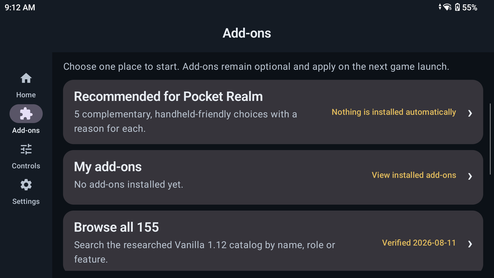

# Add-ons

The Add-ons area manages optional changes to the game interface. Nothing is installed automatically.

## The four starting points

### Recommended for Pocket Realm

This is a small set of individual suggestions chosen for handheld play. Each item can be opened and reviewed before installation. The list is not a required pack.

### My add-ons

This shows what is installed for the next game launch. It can also show available updates, remove an add-on, and offer an undo action after a recent change when rollback is available.

### Browse all

This opens the larger Vanilla 1.12 add-on catalogue. Search and detail pages help the player find an add-on by name or purpose.

The catalogue itself is packaged with the app.

### Install from GitHub

This is the advanced path for a public Vanilla-compatible repository that is not already listed. Pocket Realm checks the downloaded archive and the add-on's interface version before it becomes an installed generation.

## When changes take effect

Add-on changes apply on the next game launch. Installing or removing an add-on does not rewrite the game while it is already running.

## Safe generations and rollback

Pocket Realm prepares add-on changes as a complete generation and then publishes that generation to the managed client. This avoids leaving half-extracted folders active after a failed operation.

When an earlier generation is still available, **Undo last change** returns to it. This is useful when an update installs successfully but behaves badly in the original game client.

## What the installer checks

Before a downloaded add-on can become active, Pocket Realm checks:

- The archive is within fixed size and file-count limits.
- Paths remain inside the intended add-on folder.
- There are no links, executable payloads, duplicate paths, or dangerous path names.
- The archive does not expand to an unreasonable size.
- The add-on has a valid table-of-contents file.
- The table-of-contents file declares the Vanilla interface number 11200.
- Every file declared by that table of contents exists in the archive.

Custom GitHub installs are resolved to one exact source revision. Downloads and extraction happen in a temporary area. The installed registry changes only after the complete new generation has been verified.

These checks protect the file layout. They cannot guarantee that every add-on's Lua code is useful, bug-free, or compatible with another add-on.

## Add-ons remain optional

The built-in controller layout does not require an add-on. The Controls screen includes a complete add-on-free leveling profile.

If add-ons or the touch overlay appear to cause a problem, turn on **Input safe mode** in Settings. It disables project add-ons and the project touch overlay for the next launch without changing realm or character data.
