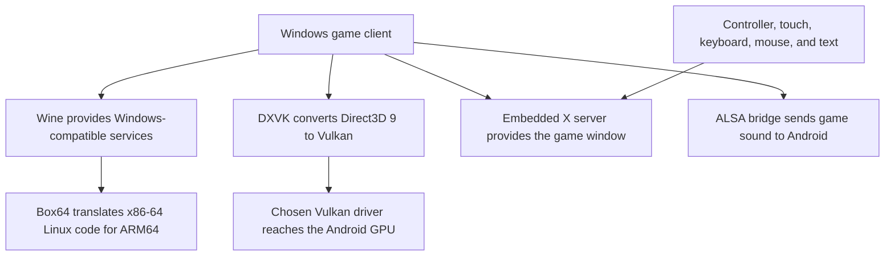

# Game Client, Graphics, Display, and Sound

Pocket Realm does not replace the original game client. It prepares and runs a private copy of the supported Windows client inside an Android-managed environment.

## Supported client

The importer accepts World of Warcraft 1.12.1 build 5875. The selected source folder stays read-only. Pocket Realm copies files into private storage, checks every copied file, and publishes a complete managed client generation only after verification succeeds.

Unexpected root programs and injected libraries are not accepted as part of the managed client. Standard files needed by the supported client are preserved.

## Preparing server data

The local world server needs more than the visible client folder. Pocket Realm runs CMaNGOS preparation tools against the private client copy to produce:

- DBC files, which describe game rules and records.
- Maps, which describe terrain.
- VMaps, which describe solid world geometry and line of sight.
- MMaps, which provide movement and pathfinding information.

These stages can take a long time. Each stage has checkpoints. Finished output is counted, hashed, recorded in a manifest, and published as an immutable generation. An incomplete set does not replace the last complete set.

## Why a Windows compatibility stack is needed

The game client was built for desktop Windows and an x86 processor. A Retroid Pocket 6 uses ARM64 Android. Several layers bridge that difference:

The current ARM package identifies a Winlator-derived runtime containing Box64 0.4.0 and Wine 10.10. The app accepts Box64 as its ARM translator and DXVK as its ARM graphics route.

## Graphics choices

The player makes two related choices in Settings.

### DXVK package

- **DXVK 2.4.1** is the current package. When paired with the system Vulkan route, it requires the device to pass the Vulkan 1.3 capability check.
- **DXVK 1.10.3** is the compatibility package. Its system route requires Vulkan 1.1.

DXVK places a Direct3D 9 replacement inside the isolated Wine environment. It converts the game's drawing requests into Vulkan requests.

### Vulkan driver

- **System Vulkan driver** uses the Vulkan driver supplied by Android through the hardened Vortek bridge. This is the normal default when the required capabilities are present.
- **Turnip 26.1.0** is a packaged Mesa driver. The current app qualifies it only for the Retroid Pocket 6 with Adreno 740.

The app keeps these identities separate because a DXVK version and a Vulkan driver solve different parts of the graphics path. It verifies the exact selected pair and does not silently replace it during launch.

## Proof that the client is really ready

A started process is not enough. Pocket Realm waits for a mapped game window and checks a fresh DXVK session log for the selected DXVK and driver identity. Only then does it report the game as running.

If the proof does not match, the client launch fails with the realm left online when it is safe to do so.

## Embedded display

The Winlator-derived X server gives the Windows client a display inside the Android activity. It manages:

- The game window and drawing surface.
- Shared-memory image transport.
- Fullscreen landscape presentation.
- Mouse, keyboard, controller, touch, and Android text input.
- Window identity used by automatic login.

Every display session has a generation number. Input from an old or replaced surface is rejected. During shutdown, the display is kept until the client service proves that the whole process tree has drained.

## Resolution and frame limit

The Performance profile uses 1280 x 720. The Sharp profile uses 1920 x 1080. The final image is fitted to the handheld screen.

The frame limit is passed to both the client setup and renderer. It limits work but cannot guarantee a stable frame rate in every scene.

## Sound

On the ARM route, Wine's ALSA audio output connects to an app-owned sound socket. The Winlator-derived Android sound server reads that stream and sends it to Android audio.

Sound is selected before launch. Turning it on does not alter realm data, and turning it off avoids starting the audio route for that client session.

## Optional client tweaks

Pocket Realm includes the open-source vanilla-tweaks 1.6.0 patcher for optional quality-of-life changes. Available choices cover widescreen field of view, background sound, sound channel count, view distances, quick loot behaviour, nameplate distance, large-address support, and a camera skip fix.

The patcher never edits the player's source folder. It works on the managed client and publishes a separate patched executable. Before using the result, Pocket Realm requires the complete recognised client hash and independently checks every expected changed byte. An unrecognised executable stays on the pristine behaviour.

## x86 validation route

The repository has a separate x86-64 Android validation route using Wine 11.14, a pinned glibc environment, PRoot, and Gladio. It helps test packaging and compatibility. Normal ARM handheld play does not use that route.

## Related pages

- [Game files and import](Game-Files-and-Import.md)
- [Settings](Settings.md)
- [Controls](Controls.md)
- [Projects and technologies used](Projects-and-Technologies.md)
