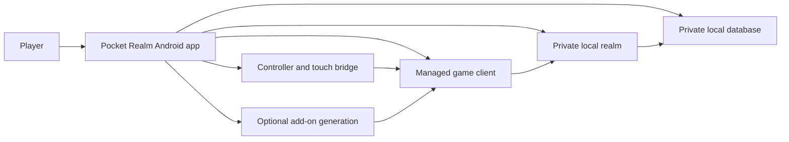

# How the Pieces Work Together

Pocket Realm hides several older desktop and server components behind one Android app. A player does not need to manage them separately, but understanding the broad flow can make status messages easier to follow.

## The Android app

The launcher is the part the player touches first. It owns the main screens, saved choices, start and stop requests, account flow, client import, add-on management, controls, and diagnostics.

## The managed game client

The visible game is the original Windows client supplied by the player. Pocket Realm runs a verified private copy through compatibility layers on Android.

On ARM devices, Box64 helps run the Windows program, Wine provides the Windows environment, and DXVK translates the game's older Direct3D graphics into Vulkan.

## The local realm

The local realm is the server side of the world. It handles logins, characters, creatures, quests, and world rules. In normal offline mode it listens only inside the device.

Computer-controlled residents use the same world while the selected population profile controls how many are admitted and how much background work they are allowed to do.

## The database

Characters and durable world state live in an app-private local database. The launcher starts the database before the realm and stops it only after important writes have been drained.

This is why Save & Exit belongs in the launcher. Closing only the visible game does not tell the whole local stack to finish.

## The runtime supervisor

The supervisor is the coordinator behind the Home status. It remembers which parts should be running, starts them in order, watches them, records progress, and recovers after an interrupted Android process when possible.

The visible states such as Starting, Saving, Stopping, Recovering, and Needs attention come from this coordinated view.

## Controller and touch bridge

Android reads the physical controller and touch input. Pocket Realm normalises the device-specific events, applies the selected profile, and sends safe keyboard, pointer, or camera actions to the game.

Android owns the real controller. Optional add-ons receive ordinary game bindings inside the original client rather than reading the Android controller directly.

## Add-on generations

Optional add-ons are prepared outside the running game. A completed generation is projected into the managed client for the next launch. If an operation fails before publication, the earlier complete generation remains the safe choice.

## Private LAN mode

When hosting is enabled, the world can also listen on the active private IPv4 address. Another Pocket Realm client on the same network can join by entering that address.

The database and administrative channels do not become public just because gameplay LAN access is enabled.

## What survives a restart

The project is designed around the fact that Android can stop an app process. Characters, realm data, import progress, selected settings, input profiles, add-on generations, and supervisor state use durable storage or recoverable journals where appropriate.

The app should not need a clean desktop-style shutdown to know what the last session was doing. It still asks the player to use Save & Exit because that is the quickest and safest normal path.

## Read the complete explanation

- [Projects and technologies used](Projects-and-Technologies.md) explains which outside projects are combined and what each one contributes.
- [Runtime supervision and recovery](Runtime-Supervision-and-Recovery.md) explains start order, stop order, separate processes, ownership, and crash recovery.
- [Game client, graphics, display, and sound](Game-Client-Graphics-and-Sound.md) follows the Windows client from import to the Android screen and speakers.
- [Local server, world, and bots](Local-Server-World-and-Bots.md) explains CMaNGOS, MariaDB, Classic-DB, Playerbots, accounts, and world saving.
- [Data, storage, and privacy](Data-Storage-and-Privacy.md) explains generations, private folders, backups, restores, credentials, and exports.
- [Accounts, security, and network boundaries](Accounts-Security-and-Networking.md) explains local accounts, automatic login, service controls, add-on checks, and LAN limits.
- [Build and packaging](Build-and-Packaging.md) explains how Kotlin, C++, Rust, Python, Gradle, and pinned packages become one APK.
