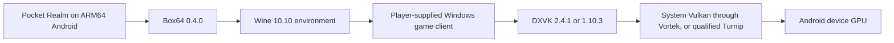
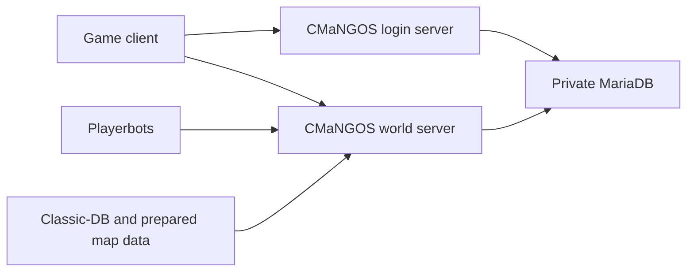

# Projects and Technologies Used

Pocket Realm is a new Android application built around several established open-source projects. Each project has one clear job. Pocket Realm supplies the coordination, safety checks, handheld interface, storage rules, and bridges that let those projects work together on one Android device.

This page describes the projects used by the current code and the job each one performs.

## The main combination

| Project or technology | What it does in Pocket Realm |
| --- | --- |
| Pocket Realm Android app | Provides Home, Settings, Controls, Add-ons, import, accounts, backups, diagnostics, and the supervisor that coordinates everything. |
| [CMaNGOS Classic](https://github.com/cmangos/mangos-classic) | Supplies the classic login server and world server. These run locally as native Android components. |
| [Classic-DB](https://github.com/cmangos/classic-db) | Supplies the starting world database used by CMaNGOS. |
| [CMaNGOS Playerbots](https://github.com/cmangos/playerbots) | Adds computer-controlled residents to the local world. Pocket Realm places mobile-friendly limits around their startup and activity. |
| [MariaDB](https://github.com/MariaDB/server) | Stores accounts, characters, and lasting world state in a private database on the device. |
| [MariaDB Connector/C](https://github.com/MariaDB/mariadb-connector-c) | Lets the native CMaNGOS server components talk to MariaDB. |
| [Box64](https://github.com/ptitSeb/box64) | Lets an ARM64 handheld run the x86-64 Linux parts of the Windows compatibility environment. The current ARM package identifies Box64 0.4.0. |
| [Wine](https://www.winehq.org/) | Provides the Windows-compatible environment needed by the player-supplied Windows game client. The current ARM route identifies Wine 10.10. |
| [DXVK](https://github.com/doitsujin/dxvk) | Converts the old Direct3D 9 graphics used by the game into Vulkan. The app includes pinned 2.4.1 and 1.10.3 choices. |
| [Winlator](https://github.com/brunodev85/winlator-app) display components | Provide the embedded X server, Android display view, shared-memory transport, sound bridge, and the Vortek Vulkan bridge used by the ARM client route. |
| Android system Vulkan driver | Provides the normal route from Vulkan to the device GPU through the Vortek bridge. |
| Mesa Turnip 26.1.0 | Provides an optional packaged Vulkan driver for the qualified Retroid Pocket 6 and Adreno 740 route. |
| [vanilla-tweaks](https://github.com/brndd/vanilla-tweaks) | Applies optional, carefully checked quality-of-life patches to the supported client. It is used only when the exact client executable is recognised. |
| Android Jetpack and Compose | Build the visible Android interface, navigation, lifecycle handling, settings storage, and background services. |

## What Pocket Realm itself adds

The outside projects do not automatically form one Android product. Pocket Realm adds the parts that join them:

- A landscape Android interface designed around a handheld screen.
- A supervisor that starts and stops the database, login server, world server, display, and client in the correct order.
- Separate Android processes so one failure is less likely to take down every part at once.
- A managed import system for a player-supplied client.
- Android controller, keyboard, mouse, touch, and text-input bridges.
- Fixed graphics packages and device checks.
- Local account creation and carefully timed optional automatic login.
- Add-on validation, complete add-on generations, and rollback.
- Database snapshots, restore verification, crash recovery, and redacted support bundles.
- Mobile bot population limits that respond to heat, memory, storage, and world delays.
- Build tools that pin versions, verify file hashes, and reject incomplete packages.

## Normal ARM handheld route

The current handheld route is:

Box64 is the only ARM translator accepted by the current runtime. DXVK is the only ARM graphics translation route. If a selected package or driver cannot be proved ready, the launch stops with an explanation instead of quietly changing to another route.

## The local server route

The login server checks the local account and supplies the realm list. The world server runs gameplay. Playerbots run inside the world server. MariaDB stores durable state. Classic-DB supplies the initial world content, while the import process prepares maps and other server data from the player's supported client.

## Build and validation tools

The final Android package also depends on tools that players do not see:

- Gradle and the Android Gradle Plugin assemble the app.
- Kotlin builds the Android application and service coordination.
- C and C++ build the native server, database bridge, client display, and data preparation tools.
- Rust builds the client tweak tool.
- Python scripts stage pinned runtime packages, generate manifests, verify hashes, and check native library requirements.
- CMake and the Android NDK build native code for the supported processor types.
- Git submodules pin the exact CMaNGOS, Classic-DB, and Playerbots source revisions used by this checkout.

These build tools are not downloaded or controlled by a normal player inside the app. They are part of producing a complete, repeatable APK.

## Normal product parts and validation-only parts

Most Android handhelds use ARM64. That is the main product route described above.

The repository also contains an x86-64 validation route. It uses a separate Wine 11.14 package, a glibc library set, PRoot, and Gladio. That route exists to test compatibility on x86 Android environments. It is not the normal Retroid Pocket 6 runtime and it should not be presented as an alternative handheld setup.

## Versions and licences

The repository pins exact versions, source revisions, file hashes, and licence files for packaged components. This protects the build from silently changing underneath the app. The short version names on this page help people understand the system, but the source manifests and licence files remain the authority for release preparation.

Pocket Realm does not include the proprietary game client. A player must provide a supported copy they are entitled to use. Open-source licences for the bundled projects also remain in force. Anyone distributing a build must review the repository's current licence material rather than treating this page as legal advice.

## Related pages

- [How the pieces work together](How-It-Works.md)
- [Runtime supervision and recovery](Runtime-Supervision-and-Recovery.md)
- [Game client, graphics, display, and sound](Game-Client-Graphics-and-Sound.md)
- [Local server, world, and bots](Local-Server-World-and-Bots.md)
- [Build and packaging](Build-and-Packaging.md)
