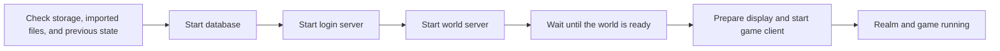

# Runtime Supervision and Recovery

Pocket Realm runs several major parts at once. The runtime supervisor is the coordinator that makes them behave like one product.

## Why a supervisor is needed

The visible game is only one part of a local session. A normal offline session can include:

- The Pocket Realm launcher.
- A private MariaDB database.
- The CMaNGOS login server.
- The CMaNGOS world server.
- The embedded client display.
- The Windows game client and its compatibility processes.

Starting or stopping these in the wrong order can cause confusing failures or an unsafe database shutdown. The supervisor gives every session an identity, records each change, and moves through a fixed order.

## Normal start order

The supervisor records progress before it reports a new visible state. If the client fails after the world is ready, the realm can remain online. This lets the player fix a graphics or client setting and try the game again without restarting the database and server unnecessarily.

## Normal save and stop order

This is why **Save & Exit** in Pocket Realm is the preferred way to finish. The original game's Quit button can close the visible client, but it does not coordinate the rest of the local stack.

## Separate Android processes

Pocket Realm puts major parts in separate private Android processes:

| Process area | Responsibility |
| --- | --- |
| Main app | Screens, navigation, and the embedded display activity. |
| Supervisor | Session ownership, start and stop order, recovery, and the foreground notification. |
| Database | MariaDB and its private live data folder. |
| Login server | Local account login and realm listing. |
| World server | Gameplay, characters, world state, saving, and bots. |
| Client | Box64, Wine, the Windows game process, and its child processes. |
| Import | Long client-copy and server-data preparation work. |

The services are private to the app. Their control connections offer fixed actions such as start, status, save, and stop. They do not accept arbitrary commands, file paths, database requests, or process environments.

## Session ownership

Each supervised component receives a session identifier and a random instance token. A service only accepts lifecycle requests from the owner that claimed it. If the owner disappears, the service treats that as a failure and closes its owned work.

This protects a new app session from accidentally stopping or claiming a leftover process from a different session.

## The runtime journal

The supervisor keeps a small durable journal. It records:

- The current phase.
- Whether the last session is clean or interrupted.
- Which components belong to the session.
- The selected local or LAN mode.
- The identities needed to recognise owned components.
- The most recent operation and failure details.

The journal does not contain account passwords. A state is written durably before the launcher publishes it as the new status.

## Recovery after interruption

Android may stop a process, the device may lose power, or a native component may crash. If the journal says the last session was not clean, the next start enters recovery first.

Recovery checks the exact components recorded for that session. It force-stops only components that still prove the matching owner identity, lets the database perform its own recovery, and then records a clean stopped state. It does not assume that every process on the device belongs to Pocket Realm.

If recovery cannot prove a safe result, the app reports that attention is needed. It does not simply mark the session clean.

## Foreground service and notification

The supervisor runs as an Android foreground service while the realm is active. This makes the long-running local realm visible to Android and to the player. The notification provides the save and exit action.

A wake lock is used only around finite lifecycle and maintenance work, not as an excuse to hold the device awake forever.

## Local and LAN modes

Pocket Realm has three runtime shapes:

| Mode | Parts started on this device |
| --- | --- |
| Local | Database, login server, world server, and optional local client. |
| LAN host | The same local stack, with gameplay bound to the selected private network address. |
| LAN join | Client only. It connects to a host on the same private network. |

LAN addresses must be numeric private or link-local IPv4 addresses. Public addresses and hostnames are rejected. A hosting session is tied to the active network address, so changing networks invalidates that session instead of exposing a server on an unexpected interface.

## What the player sees

Internal phases are translated into plain Home states such as Starting, Realm online, Saving, Stopping, Recovering, Client failed, and Needs attention. The detail text should identify which part failed without making the player understand Android process names.

## Related pages

- [The Home screen](Home-Screen.md)
- [Backups, diagnostics, and support](Backups-and-Diagnostics.md)
- [Data, storage, and privacy](Data-Storage-and-Privacy.md)
- [Troubleshooting](Troubleshooting.md)
