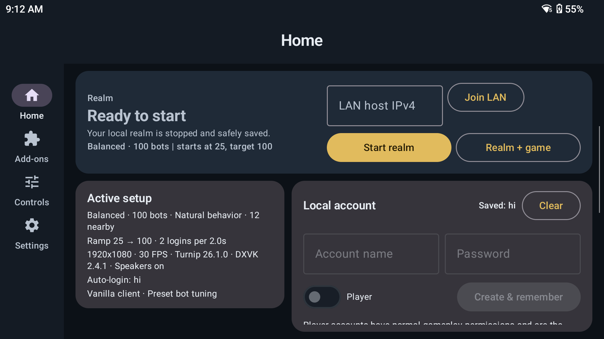
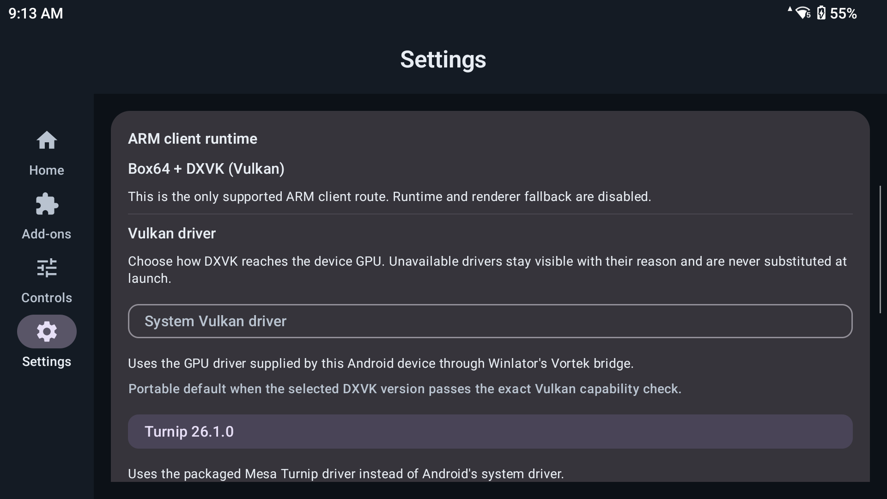
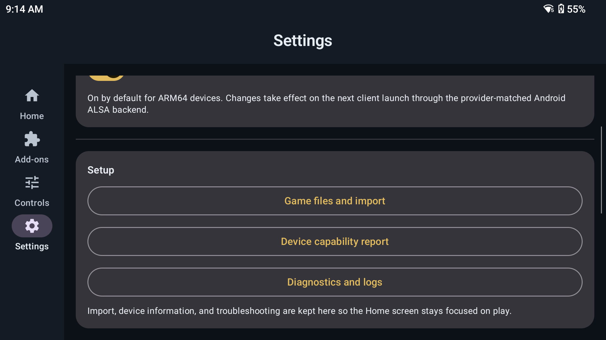

# Screenshot Gallery

These screenshots were captured from the current app running on a Retroid Pocket 6 on 14 August 2026. They show the launcher state at that time. Values such as account name, selected population, graphics package, and battery level are examples from the test device.

## Home

The Home screen keeps realm status, start actions, the active setup summary, LAN join, and the local account in one place.

## Add-ons

The Add-ons hub separates recommended choices, installed add-ons, the full catalogue, and advanced GitHub installation.

## Runtime settings

The top of Settings explains the supported ARM route and shows the Vulkan driver and DXVK choices.

## Setup shortcuts

The bottom of Settings links to client import, the device capability report, and diagnostics.
